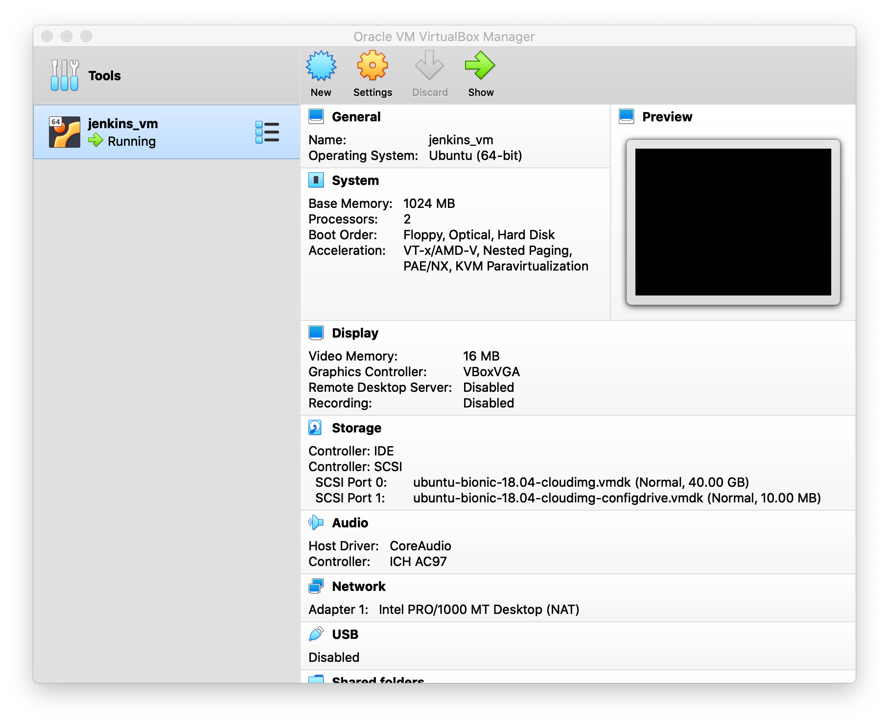
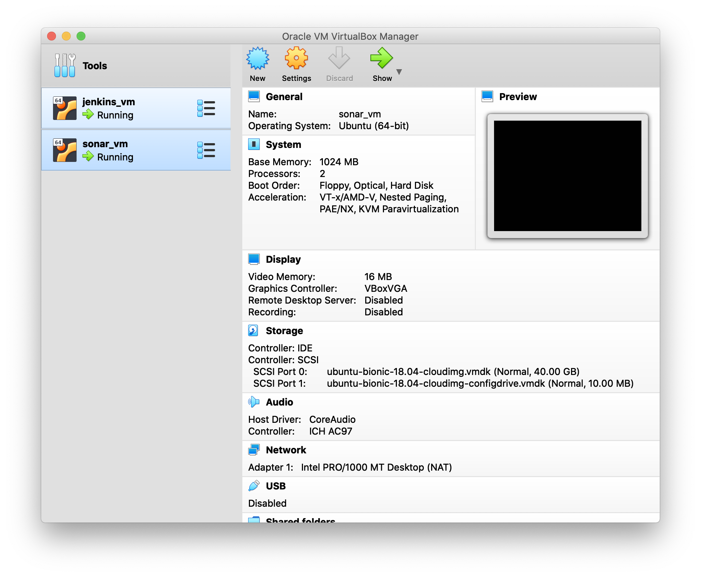
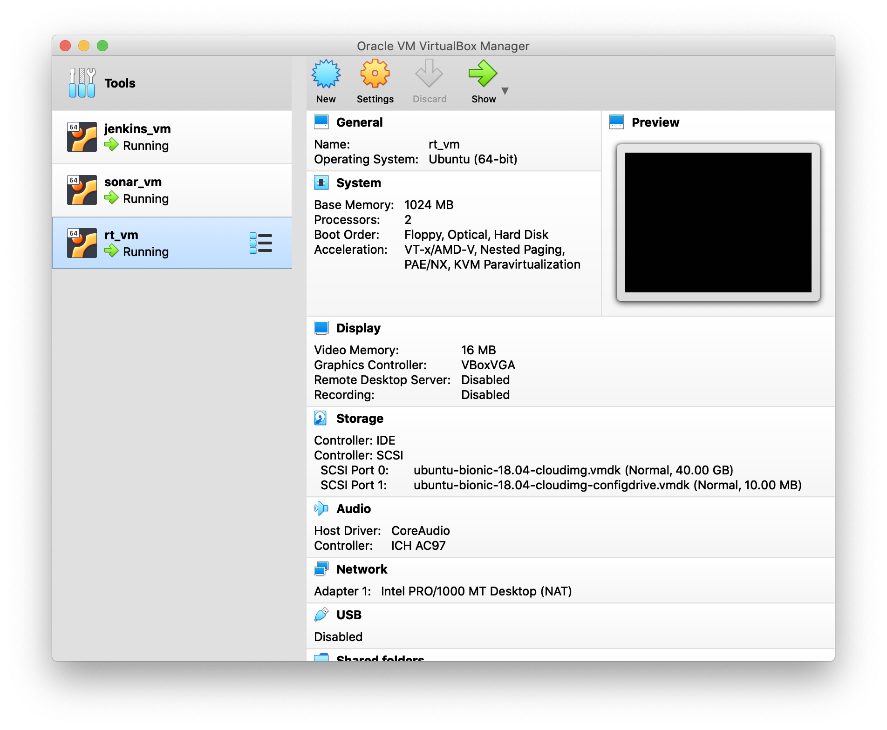
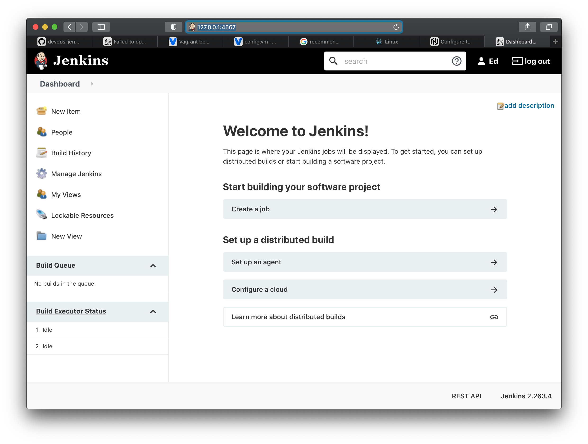
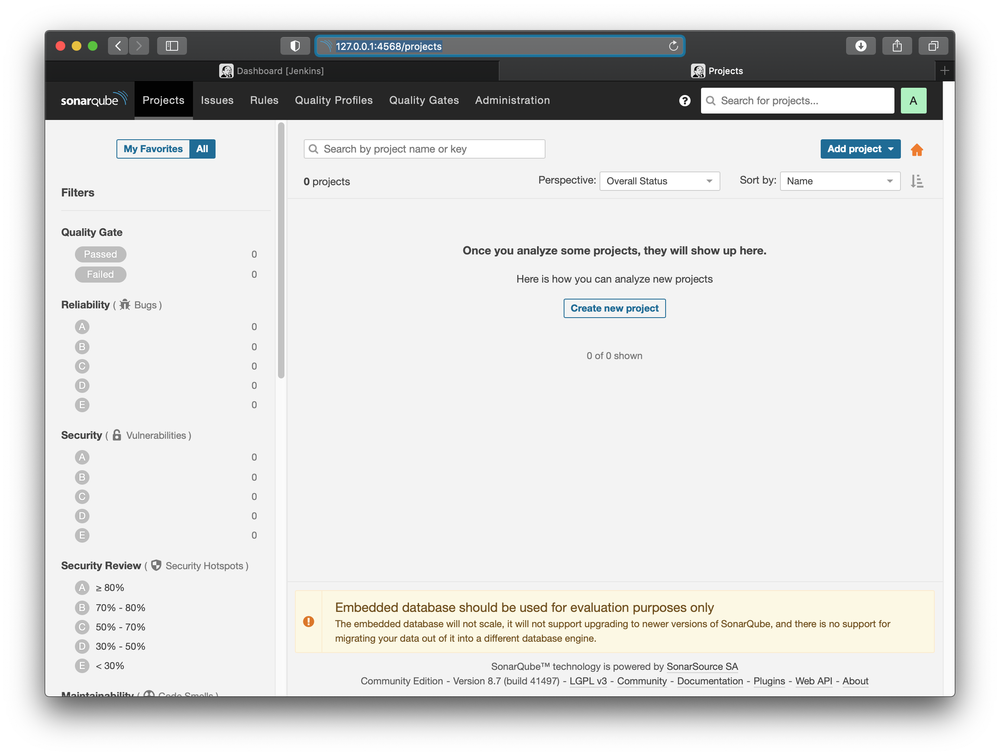
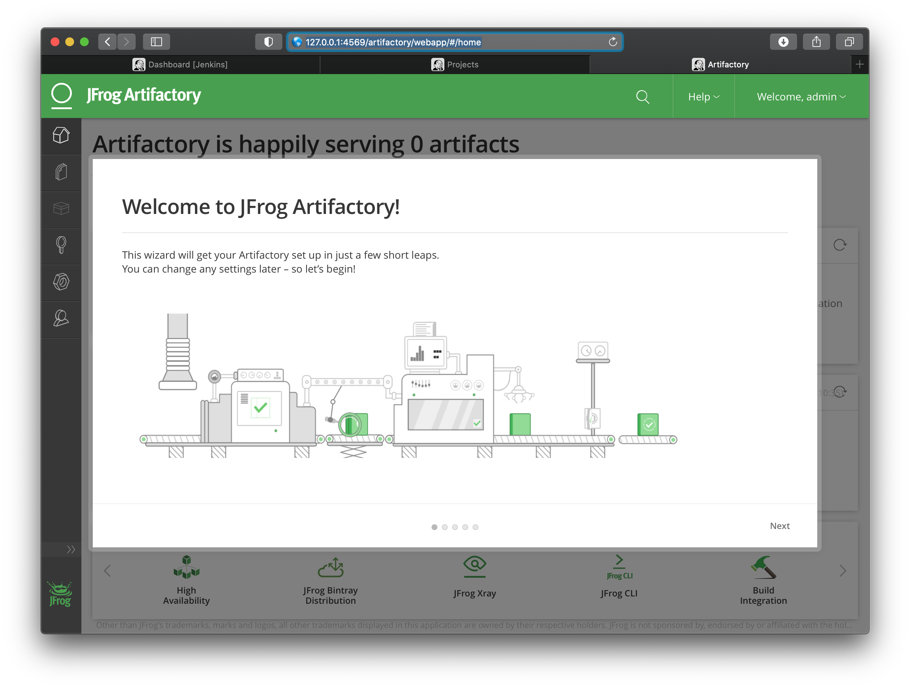

Ed Owen

# ASSIGNMENT 2

## Create Vagrant Boxes

### Jenkins VM

    devops@MacBook-Pro:~/devops/repos/ucsc-devops-02|main⚡ ⇒  take jenkins
    devops@MacBook-Pro:~/devops/repos/ucsc-devops-02/jenkins|main⚡ ⇒  vagrant init ubuntu/bionic64
    A `Vagrantfile` has been placed in this directory. You are now
    ready to `vagrant up` your first virtual environment! Please read
    the comments in the Vagrantfile as well as documentation on
    `vagrantup.com` for more information on using Vagrant.

Added the following lines to jenkins/Vagrantfile:

    config.vm.provider "virtualbox" do |v|
        v.name = "jenkins_vm"
        v.memory = "1024"
    end

then:

    devops@MacBook-Pro:~/devops/repos/ucsc-devops-02/jenkins|main⚡ ⇒  vagrant up
    Bringing machine 'default' up with 'virtualbox' provider...
    ==> default: Box 'ubuntu/bionic64' could not be found. Attempting to find and install...
        default: Box Provider: virtualbox
        default: Box Version: >= 0
    ==> default: Loading metadata for box 'ubuntu/bionic64'
        default: URL: https://vagrantcloud.com/ubuntu/bionic64
    ==> default: Adding box 'ubuntu/bionic64' (v20210305.0.0) for provider: virtualbox
        default: Downloading: https://vagrantcloud.com/ubuntu/boxes/bionic64/versions/20210305.0.0/providers/virtualbox.box
    Download redirected to host: cloud-images.ubuntu.com
    ==> default: Successfully added box 'ubuntu/bionic64' (v20210305.0.0) for 'virtualbox'!
    ==> default: Importing base box 'ubuntu/bionic64'...
    ==> default: Matching MAC address for NAT networking...
    ==> default: Checking if box 'ubuntu/bionic64' version '20210305.0.0' is up to date...
    ==> default: Setting the name of the VM: jenkins_vm
    ==> default: Clearing any previously set network interfaces...
    ==> default: Preparing network interfaces based on configuration...
        default: Adapter 1: nat
    ==> default: Forwarding ports...
        default: 22 (guest) => 2222 (host) (adapter 1)
    ==> default: Running 'pre-boot' VM customizations...
    ==> default: Booting VM...
    ==> default: Waiting for machine to boot. This may take a few minutes...
        default: SSH address: 127.0.0.1:2222
        default: SSH username: vagrant
        default: SSH auth method: private key
        default: Warning: Connection reset. Retrying...
        default: Warning: Remote connection disconnect. Retrying...
        default:
        default: Vagrant insecure key detected. Vagrant will automatically replace
        default: this with a newly generated keypair for better security.
        default:
        default: Inserting generated public key within guest...
        default: Removing insecure key from the guest if it's present...
        default: Key inserted! Disconnecting and reconnecting using new SSH key...
    ==> default: Machine booted and ready!
    Got different reports about installed GuestAdditions version:
    Virtualbox on your host claims:   5.2.8
    VBoxService inside the vm claims: 5.2.42
    Going on, assuming VBoxService is correct...
    [default] A Virtualbox Guest Additions installation was found but no tools to rebuild or start them.
    Got different reports about installed GuestAdditions version:
    Virtualbox on your host claims:   5.2.8
    VBoxService inside the vm claims: 5.2.42
    Going on, assuming VBoxService is correct...
    Reading package lists...
    Building dependency tree...
    Reading state information...
    Package 'virtualbox-guest-x11' is not installed, so not removed
    The following packages will be REMOVED:
    virtualbox-guest-utils*
    0 upgraded, 0 newly installed, 1 to remove and 0 not upgraded.
    After this operation, 2854 kB disk space will be freed.
    (Reading database ... 59827 files and directories currently installed.)
    Removing virtualbox-guest-utils (5.2.42-dfsg-0~ubuntu1.18.04.1) ...
    Processing triggers for man-db (2.8.3-2ubuntu0.1) ...
    (Reading database ... 59814 files and directories currently installed.)
    Purging configuration files for virtualbox-guest-utils (5.2.42-dfsg-0~ubuntu1.18.04.1) ...
    Processing triggers for systemd (237-3ubuntu10.44) ...
    Processing triggers for ureadahead (0.100.0-21) ...
    Reading package lists...
    Building dependency tree...
    Reading state information...
    linux-headers-4.15.0-136-generic is already the newest version (4.15.0-136.140).
    linux-headers-4.15.0-136-generic set to manually installed.
    The following additional packages will be installed:
    binutils binutils-common binutils-x86-64-linux-gnu build-essential cpp cpp-7
    dpkg-dev fakeroot g++ g++-7 gcc gcc-7 gcc-7-base libalgorithm-diff-perl
    libalgorithm-diff-xs-perl libalgorithm-merge-perl libasan4 libatomic1
    libbinutils libc-dev-bin libc6-dev libcc1-0 libcilkrts5 libdpkg-perl
    libfakeroot libfile-fcntllock-perl libgcc-7-dev libgomp1 libisl19 libitm1
    liblsan0 libmpc3 libmpx2 libquadmath0 libstdc++-7-dev libtsan0 libubsan0
    linux-libc-dev make manpages-dev
    Suggested packages:
    binutils-doc cpp-doc gcc-7-locales menu debian-keyring g++-multilib
    g++-7-multilib gcc-7-doc libstdc++6-7-dbg gcc-multilib autoconf automake
    libtool flex bison gdb gcc-doc gcc-7-multilib libgcc1-dbg libgomp1-dbg
    libitm1-dbg libatomic1-dbg libasan4-dbg liblsan0-dbg libtsan0-dbg
    libubsan0-dbg libcilkrts5-dbg libmpx2-dbg libquadmath0-dbg glibc-doc bzr
    libstdc++-7-doc make-doc
    The following NEW packages will be installed:
    binutils binutils-common binutils-x86-64-linux-gnu build-essential cpp cpp-7
    dkms dpkg-dev fakeroot g++ g++-7 gcc gcc-7 gcc-7-base libalgorithm-diff-perl
    libalgorithm-diff-xs-perl libalgorithm-merge-perl libasan4 libatomic1
    libbinutils libc-dev-bin libc6-dev libcc1-0 libcilkrts5 libdpkg-perl
    libfakeroot libfile-fcntllock-perl libgcc-7-dev libgomp1 libisl19 libitm1
    liblsan0 libmpc3 libmpx2 libquadmath0 libstdc++-7-dev libtsan0 libubsan0
    linux-libc-dev make manpages-dev
    0 upgraded, 41 newly installed, 0 to remove and 0 not upgraded.
    Need to get 43.0 MB of archives.
    After this operation, 166 MB of additional disk space will be used.
    Get:1 http://archive.ubuntu.com/ubuntu bionic-updates/main amd64 binutils-common amd64 2.30-21ubuntu1~18.04.5 [197 kB]
    Get:2 http://archive.ubuntu.com/ubuntu bionic-updates/main amd64 libbinutils amd64 2.30-21ubuntu1~18.04.5 [489 kB]
    Get:3 http://archive.ubuntu.com/ubuntu bionic-updates/main amd64 binutils-x86-64-linux-gnu amd64 2.30-21ubuntu1~18.04.5 [1839 kB]
    Get:4 http://archive.ubuntu.com/ubuntu bionic-updates/main amd64 binutils amd64 2.30-21ubuntu1~18.04.5 [3388 B]
    Get:5 http://archive.ubuntu.com/ubuntu bionic-updates/main amd64 libc-dev-bin amd64 2.27-3ubuntu1.4 [71.8 kB]
    Get:6 http://archive.ubuntu.com/ubuntu bionic-updates/main amd64 linux-libc-dev amd64 4.15.0-136.140 [1001 kB]
    Get:7 http://archive.ubuntu.com/ubuntu bionic-updates/main amd64 libc6-dev amd64 2.27-3ubuntu1.4 [2585 kB]
    Get:8 http://archive.ubuntu.com/ubuntu bionic-updates/main amd64 gcc-7-base amd64 7.5.0-3ubuntu1~18.04 [18.3 kB]
    Get:9 http://archive.ubuntu.com/ubuntu bionic/main amd64 libisl19 amd64 0.19-1 [551 kB]
    Get:10 http://archive.ubuntu.com/ubuntu bionic/main amd64 libmpc3 amd64 1.1.0-1 [40.8 kB]
    Get:11 http://archive.ubuntu.com/ubuntu bionic-updates/main amd64 cpp-7 amd64 7.5.0-3ubuntu1~18.04 [8591 kB]
    Get:12 http://archive.ubuntu.com/ubuntu bionic-updates/main amd64 cpp amd64 4:7.4.0-1ubuntu2.3 [27.7 kB]
    Get:13 http://archive.ubuntu.com/ubuntu bionic-updates/main amd64 libcc1-0 amd64 8.4.0-1ubuntu1~18.04 [39.4 kB]
    Get:14 http://archive.ubuntu.com/ubuntu bionic-updates/main amd64 libgomp1 amd64 8.4.0-1ubuntu1~18.04 [76.5 kB]
    Get:15 http://archive.ubuntu.com/ubuntu bionic-updates/main amd64 libitm1 amd64 8.4.0-1ubuntu1~18.04 [27.9 kB]
    Get:16 http://archive.ubuntu.com/ubuntu bionic-updates/main amd64 libatomic1 amd64 8.4.0-1ubuntu1~18.04 [9192 B]
    Get:17 http://archive.ubuntu.com/ubuntu bionic-updates/main amd64 libasan4 amd64 7.5.0-3ubuntu1~18.04 [358 kB]
    Get:18 http://archive.ubuntu.com/ubuntu bionic-updates/main amd64 liblsan0 amd64 8.4.0-1ubuntu1~18.04 [133 kB]
    Get:19 http://archive.ubuntu.com/ubuntu bionic-updates/main amd64 libtsan0 amd64 8.4.0-1ubuntu1~18.04 [288 kB]
    Get:20 http://archive.ubuntu.com/ubuntu bionic-updates/main amd64 libubsan0 amd64 7.5.0-3ubuntu1~18.04 [126 kB]
    Get:21 http://archive.ubuntu.com/ubuntu bionic-updates/main amd64 libcilkrts5 amd64 7.5.0-3ubuntu1~18.04 [42.5 kB]
    Get:22 http://archive.ubuntu.com/ubuntu bionic-updates/main amd64 libmpx2 amd64 8.4.0-1ubuntu1~18.04 [11.6 kB]
    Get:23 http://archive.ubuntu.com/ubuntu bionic-updates/main amd64 libquadmath0 amd64 8.4.0-1ubuntu1~18.04 [134 kB]
    Get:24 http://archive.ubuntu.com/ubuntu bionic-updates/main amd64 libgcc-7-dev amd64 7.5.0-3ubuntu1~18.04 [2378 kB]
    Get:25 http://archive.ubuntu.com/ubuntu bionic-updates/main amd64 gcc-7 amd64 7.5.0-3ubuntu1~18.04 [9381 kB]
    Get:26 http://archive.ubuntu.com/ubuntu bionic-updates/main amd64 gcc amd64 4:7.4.0-1ubuntu2.3 [5184 B]
    Get:27 http://archive.ubuntu.com/ubuntu bionic-updates/main amd64 libstdc++-7-dev amd64 7.5.0-3ubuntu1~18.04 [1471 kB]
    Get:28 http://archive.ubuntu.com/ubuntu bionic-updates/main amd64 g++-7 amd64 7.5.0-3ubuntu1~18.04 [9697 kB]
    Get:29 http://archive.ubuntu.com/ubuntu bionic-updates/main amd64 g++ amd64 4:7.4.0-1ubuntu2.3 [1568 B]
    Get:30 http://archive.ubuntu.com/ubuntu bionic/main amd64 make amd64 4.1-9.1ubuntu1 [154 kB]
    Get:31 http://archive.ubuntu.com/ubuntu bionic-updates/main amd64 libdpkg-perl all 1.19.0.5ubuntu2.3 [211 kB]
    Get:32 http://archive.ubuntu.com/ubuntu bionic-updates/main amd64 dpkg-dev all 1.19.0.5ubuntu2.3 [607 kB]
    Get:33 http://archive.ubuntu.com/ubuntu bionic/main amd64 build-essential amd64 12.4ubuntu1 [4758 B]
    Get:34 http://archive.ubuntu.com/ubuntu bionic-updates/main amd64 dkms all 2.3-3ubuntu9.7 [68.1 kB]
    Get:35 http://archive.ubuntu.com/ubuntu bionic/main amd64 libfakeroot amd64 1.22-2ubuntu1 [25.9 kB]
    Get:36 http://archive.ubuntu.com/ubuntu bionic/main amd64 fakeroot amd64 1.22-2ubuntu1 [62.3 kB]
    Get:37 http://archive.ubuntu.com/ubuntu bionic/main amd64 libalgorithm-diff-perl all 1.19.03-1 [47.6 kB]
    Get:38 http://archive.ubuntu.com/ubuntu bionic/main amd64 libalgorithm-diff-xs-perl amd64 0.04-5 [11.1 kB]
    Get:39 http://archive.ubuntu.com/ubuntu bionic/main amd64 libalgorithm-merge-perl all 0.08-3 [12.0 kB]
    Get:40 http://archive.ubuntu.com/ubuntu bionic/main amd64 libfile-fcntllock-perl amd64 0.22-3build2 [33.2 kB]
    Get:41 http://archive.ubuntu.com/ubuntu bionic/main amd64 manpages-dev all 4.15-1 [2217 kB]
    Fetched 43.0 MB in 8s (5703 kB/s)
    Selecting previously unselected package binutils-common:amd64.
    (Reading database ... 59813 files and directories currently installed.)
    Preparing to unpack .../00-binutils-common_2.30-21ubuntu1~18.04.5_amd64.deb ...
    Unpacking binutils-common:amd64 (2.30-21ubuntu1~18.04.5) ...
    Selecting previously unselected package libbinutils:amd64.
    Preparing to unpack .../01-libbinutils_2.30-21ubuntu1~18.04.5_amd64.deb ...
    Unpacking libbinutils:amd64 (2.30-21ubuntu1~18.04.5) ...
    Selecting previously unselected package binutils-x86-64-linux-gnu.
    Preparing to unpack .../02-binutils-x86-64-linux-gnu_2.30-21ubuntu1~18.04.5_amd64.deb ...
    Unpacking binutils-x86-64-linux-gnu (2.30-21ubuntu1~18.04.5) ...
    Selecting previously unselected package binutils.
    Preparing to unpack .../03-binutils_2.30-21ubuntu1~18.04.5_amd64.deb ...
    Unpacking binutils (2.30-21ubuntu1~18.04.5) ...
    Selecting previously unselected package libc-dev-bin.
    Preparing to unpack .../04-libc-dev-bin_2.27-3ubuntu1.4_amd64.deb ...
    Unpacking libc-dev-bin (2.27-3ubuntu1.4) ...
    Selecting previously unselected package linux-libc-dev:amd64.
    Preparing to unpack .../05-linux-libc-dev_4.15.0-136.140_amd64.deb ...
    Unpacking linux-libc-dev:amd64 (4.15.0-136.140) ...
    Selecting previously unselected package libc6-dev:amd64.
    Preparing to unpack .../06-libc6-dev_2.27-3ubuntu1.4_amd64.deb ...
    Unpacking libc6-dev:amd64 (2.27-3ubuntu1.4) ...
    Selecting previously unselected package gcc-7-base:amd64.
    Preparing to unpack .../07-gcc-7-base_7.5.0-3ubuntu1~18.04_amd64.deb ...
    Unpacking gcc-7-base:amd64 (7.5.0-3ubuntu1~18.04) ...
    Selecting previously unselected package libisl19:amd64.
    Preparing to unpack .../08-libisl19_0.19-1_amd64.deb ...
    Unpacking libisl19:amd64 (0.19-1) ...
    Selecting previously unselected package libmpc3:amd64.
    Preparing to unpack .../09-libmpc3_1.1.0-1_amd64.deb ...
    Unpacking libmpc3:amd64 (1.1.0-1) ...
    Selecting previously unselected package cpp-7.
    Preparing to unpack .../10-cpp-7_7.5.0-3ubuntu1~18.04_amd64.deb ...
    Unpacking cpp-7 (7.5.0-3ubuntu1~18.04) ...
    Selecting previously unselected package cpp.
    Preparing to unpack .../11-cpp_4%3a7.4.0-1ubuntu2.3_amd64.deb ...
    Unpacking cpp (4:7.4.0-1ubuntu2.3) ...
    Selecting previously unselected package libcc1-0:amd64.
    Preparing to unpack .../12-libcc1-0_8.4.0-1ubuntu1~18.04_amd64.deb ...
    Unpacking libcc1-0:amd64 (8.4.0-1ubuntu1~18.04) ...
    Selecting previously unselected package libgomp1:amd64.
    Preparing to unpack .../13-libgomp1_8.4.0-1ubuntu1~18.04_amd64.deb ...
    Unpacking libgomp1:amd64 (8.4.0-1ubuntu1~18.04) ...
    Selecting previously unselected package libitm1:amd64.
    Preparing to unpack .../14-libitm1_8.4.0-1ubuntu1~18.04_amd64.deb ...
    Unpacking libitm1:amd64 (8.4.0-1ubuntu1~18.04) ...
    Selecting previously unselected package libatomic1:amd64.
    Preparing to unpack .../15-libatomic1_8.4.0-1ubuntu1~18.04_amd64.deb ...
    Unpacking libatomic1:amd64 (8.4.0-1ubuntu1~18.04) ...
    Selecting previously unselected package libasan4:amd64.
    Preparing to unpack .../16-libasan4_7.5.0-3ubuntu1~18.04_amd64.deb ...
    Unpacking libasan4:amd64 (7.5.0-3ubuntu1~18.04) ...
    Selecting previously unselected package liblsan0:amd64.
    Preparing to unpack .../17-liblsan0_8.4.0-1ubuntu1~18.04_amd64.deb ...
    Unpacking liblsan0:amd64 (8.4.0-1ubuntu1~18.04) ...
    Selecting previously unselected package libtsan0:amd64.
    Preparing to unpack .../18-libtsan0_8.4.0-1ubuntu1~18.04_amd64.deb ...
    Unpacking libtsan0:amd64 (8.4.0-1ubuntu1~18.04) ...
    Selecting previously unselected package libubsan0:amd64.
    Preparing to unpack .../19-libubsan0_7.5.0-3ubuntu1~18.04_amd64.deb ...
    Unpacking libubsan0:amd64 (7.5.0-3ubuntu1~18.04) ...
    Selecting previously unselected package libcilkrts5:amd64.
    Preparing to unpack .../20-libcilkrts5_7.5.0-3ubuntu1~18.04_amd64.deb ...
    Unpacking libcilkrts5:amd64 (7.5.0-3ubuntu1~18.04) ...
    Selecting previously unselected package libmpx2:amd64.
    Preparing to unpack .../21-libmpx2_8.4.0-1ubuntu1~18.04_amd64.deb ...
    Unpacking libmpx2:amd64 (8.4.0-1ubuntu1~18.04) ...
    Selecting previously unselected package libquadmath0:amd64.
    Preparing to unpack .../22-libquadmath0_8.4.0-1ubuntu1~18.04_amd64.deb ...
    Unpacking libquadmath0:amd64 (8.4.0-1ubuntu1~18.04) ...
    Selecting previously unselected package libgcc-7-dev:amd64.
    Preparing to unpack .../23-libgcc-7-dev_7.5.0-3ubuntu1~18.04_amd64.deb ...
    Unpacking libgcc-7-dev:amd64 (7.5.0-3ubuntu1~18.04) ...
    Selecting previously unselected package gcc-7.
    Preparing to unpack .../24-gcc-7_7.5.0-3ubuntu1~18.04_amd64.deb ...
    Unpacking gcc-7 (7.5.0-3ubuntu1~18.04) ...
    Selecting previously unselected package gcc.
    Preparing to unpack .../25-gcc_4%3a7.4.0-1ubuntu2.3_amd64.deb ...
    Unpacking gcc (4:7.4.0-1ubuntu2.3) ...
    Selecting previously unselected package libstdc++-7-dev:amd64.
    Preparing to unpack .../26-libstdc++-7-dev_7.5.0-3ubuntu1~18.04_amd64.deb ...
    Unpacking libstdc++-7-dev:amd64 (7.5.0-3ubuntu1~18.04) ...
    Selecting previously unselected package g++-7.
    Preparing to unpack .../27-g++-7_7.5.0-3ubuntu1~18.04_amd64.deb ...
    Unpacking g++-7 (7.5.0-3ubuntu1~18.04) ...
    Selecting previously unselected package g++.
    Preparing to unpack .../28-g++_4%3a7.4.0-1ubuntu2.3_amd64.deb ...
    Unpacking g++ (4:7.4.0-1ubuntu2.3) ...
    Selecting previously unselected package make.
    Preparing to unpack .../29-make_4.1-9.1ubuntu1_amd64.deb ...
    Unpacking make (4.1-9.1ubuntu1) ...
    Selecting previously unselected package libdpkg-perl.
    Preparing to unpack .../30-libdpkg-perl_1.19.0.5ubuntu2.3_all.deb ...
    Unpacking libdpkg-perl (1.19.0.5ubuntu2.3) ...
    Selecting previously unselected package dpkg-dev.
    Preparing to unpack .../31-dpkg-dev_1.19.0.5ubuntu2.3_all.deb ...
    Unpacking dpkg-dev (1.19.0.5ubuntu2.3) ...
    Selecting previously unselected package build-essential.
    Preparing to unpack .../32-build-essential_12.4ubuntu1_amd64.deb ...
    Unpacking build-essential (12.4ubuntu1) ...
    Selecting previously unselected package dkms.
    Preparing to unpack .../33-dkms_2.3-3ubuntu9.7_all.deb ...
    Unpacking dkms (2.3-3ubuntu9.7) ...
    Selecting previously unselected package libfakeroot:amd64.
    Preparing to unpack .../34-libfakeroot_1.22-2ubuntu1_amd64.deb ...
    Unpacking libfakeroot:amd64 (1.22-2ubuntu1) ...
    Selecting previously unselected package fakeroot.
    Preparing to unpack .../35-fakeroot_1.22-2ubuntu1_amd64.deb ...
    Unpacking fakeroot (1.22-2ubuntu1) ...
    Selecting previously unselected package libalgorithm-diff-perl.
    Preparing to unpack .../36-libalgorithm-diff-perl_1.19.03-1_all.deb ...
    Unpacking libalgorithm-diff-perl (1.19.03-1) ...
    Selecting previously unselected package libalgorithm-diff-xs-perl.
    Preparing to unpack .../37-libalgorithm-diff-xs-perl_0.04-5_amd64.deb ...
    Unpacking libalgorithm-diff-xs-perl (0.04-5) ...
    Selecting previously unselected package libalgorithm-merge-perl.
    Preparing to unpack .../38-libalgorithm-merge-perl_0.08-3_all.deb ...
    Unpacking libalgorithm-merge-perl (0.08-3) ...
    Selecting previously unselected package libfile-fcntllock-perl.
    Preparing to unpack .../39-libfile-fcntllock-perl_0.22-3build2_amd64.deb ...
    Unpacking libfile-fcntllock-perl (0.22-3build2) ...
    Selecting previously unselected package manpages-dev.
    Preparing to unpack .../40-manpages-dev_4.15-1_all.deb ...
    Unpacking manpages-dev (4.15-1) ...
    Setting up libquadmath0:amd64 (8.4.0-1ubuntu1~18.04) ...
    Setting up libgomp1:amd64 (8.4.0-1ubuntu1~18.04) ...
    Setting up libatomic1:amd64 (8.4.0-1ubuntu1~18.04) ...
    Setting up libcc1-0:amd64 (8.4.0-1ubuntu1~18.04) ...
    Setting up make (4.1-9.1ubuntu1) ...
    Setting up libtsan0:amd64 (8.4.0-1ubuntu1~18.04) ...
    Setting up linux-libc-dev:amd64 (4.15.0-136.140) ...
    Setting up libdpkg-perl (1.19.0.5ubuntu2.3) ...
    Setting up liblsan0:amd64 (8.4.0-1ubuntu1~18.04) ...
    Setting up gcc-7-base:amd64 (7.5.0-3ubuntu1~18.04) ...
    Setting up binutils-common:amd64 (2.30-21ubuntu1~18.04.5) ...
    Setting up libfile-fcntllock-perl (0.22-3build2) ...
    Setting up libmpx2:amd64 (8.4.0-1ubuntu1~18.04) ...
    Setting up libfakeroot:amd64 (1.22-2ubuntu1) ...
    Setting up libalgorithm-diff-perl (1.19.03-1) ...
    Setting up libmpc3:amd64 (1.1.0-1) ...
    Setting up libc-dev-bin (2.27-3ubuntu1.4) ...
    Setting up manpages-dev (4.15-1) ...
    Setting up libc6-dev:amd64 (2.27-3ubuntu1.4) ...
    Setting up libitm1:amd64 (8.4.0-1ubuntu1~18.04) ...
    Setting up libisl19:amd64 (0.19-1) ...
    Setting up libasan4:amd64 (7.5.0-3ubuntu1~18.04) ...
    Setting up libbinutils:amd64 (2.30-21ubuntu1~18.04.5) ...
    Setting up libcilkrts5:amd64 (7.5.0-3ubuntu1~18.04) ...
    Setting up libubsan0:amd64 (7.5.0-3ubuntu1~18.04) ...
    Setting up fakeroot (1.22-2ubuntu1) ...
    update-alternatives: using /usr/bin/fakeroot-sysv to provide /usr/bin/fakeroot (fakeroot) in auto mode
    Setting up libgcc-7-dev:amd64 (7.5.0-3ubuntu1~18.04) ...
    Setting up cpp-7 (7.5.0-3ubuntu1~18.04) ...
    Setting up libstdc++-7-dev:amd64 (7.5.0-3ubuntu1~18.04) ...
    Setting up libalgorithm-merge-perl (0.08-3) ...
    Setting up libalgorithm-diff-xs-perl (0.04-5) ...
    Setting up binutils-x86-64-linux-gnu (2.30-21ubuntu1~18.04.5) ...
    Setting up cpp (4:7.4.0-1ubuntu2.3) ...
    Setting up binutils (2.30-21ubuntu1~18.04.5) ...
    Setting up gcc-7 (7.5.0-3ubuntu1~18.04) ...
    Setting up g++-7 (7.5.0-3ubuntu1~18.04) ...
    Setting up gcc (4:7.4.0-1ubuntu2.3) ...
    Setting up dpkg-dev (1.19.0.5ubuntu2.3) ...
    Setting up dkms (2.3-3ubuntu9.7) ...
    Setting up g++ (4:7.4.0-1ubuntu2.3) ...
    update-alternatives: using /usr/bin/g++ to provide /usr/bin/c++ (c++) in auto mode
    Setting up build-essential (12.4ubuntu1) ...
    Processing triggers for man-db (2.8.3-2ubuntu0.1) ...
    Processing triggers for libc-bin (2.27-3ubuntu1.4) ...
    Copy iso file /Applications/VirtualBox.app/Contents/MacOS/VBoxGuestAdditions.iso into the box /tmp/VBoxGuestAdditions.iso
    Mounting Virtualbox Guest Additions ISO to: /mnt
    mount: /mnt: WARNING: device write-protected, mounted read-only.
    Installing Virtualbox Guest Additions 6.1.16 - guest version is 5.2.42
    Verifying archive integrity... All good.
    Uncompressing VirtualBox 6.1.16 Guest Additions for Linux........
    VirtualBox Guest Additions installer
    Copying additional installer modules ...
    Installing additional modules ...
    VirtualBox Guest Additions: Starting.
    VirtualBox Guest Additions: Building the VirtualBox Guest Additions kernel
    modules.  This may take a while.
    VirtualBox Guest Additions: To build modules for other installed kernels, run
    VirtualBox Guest Additions:   /sbin/rcvboxadd quicksetup <version>
    VirtualBox Guest Additions: or
    VirtualBox Guest Additions:   /sbin/rcvboxadd quicksetup all
    VirtualBox Guest Additions: Building the modules for kernel 4.15.0-136-generic.
    update-initramfs: Generating /boot/initrd.img-4.15.0-136-generic
    Unmounting Virtualbox Guest Additions ISO from: /mnt
    ==> default: Checking for guest additions in VM...
    ==> default: Mounting shared folders...
        default: /vagrant => /Users/devops/devops/repos/ucsc-devops-02/jenkins
    
    devops@MacBook-Pro:~/devops/repos/ucsc-devops-02/jenkins|main⚡ ⇒  vagrant global-status
    id       name    provider   state   directory
    --------------------------------------------------------------------------------------
    cfb523b  default virtualbox running /Users/devops/devops/repos/ucsc-devops-02/jenkins

    The above shows information about all known Vagrant environments
    on this machine. This data is cached and may not be completely
    up-to-date (use "vagrant global-status --prune" to prune invalid
    entries). To interact with any of the machines, you can go to that
    directory and run Vagrant, or you can use the ID directly with
    Vagrant commands from any directory. For example:
    "vagrant destroy 1a2b3c4d"

### Sonarqube VM

    devops@MacBook-Pro:~/devops/repos/ucsc-devops-02|main⚡ ⇒  take sonar
    devops@MacBook-Pro:~/devops/repos/ucsc-devops-02/sonar|main⚡ ⇒  vagrant init ubuntu/bionic64
    A `Vagrantfile` has been placed in this directory. You are now
    ready to `vagrant up` your first virtual environment! Please read
    the comments in the Vagrantfile as well as documentation on
    `vagrantup.com` for more information on using Vagrant.

Added the following lines to jenkins/Vagrantfile:

    config.vm.provider "virtualbox" do |v|
        v.name = "sonar_vm"
        v.memory = "1024"
    end

then:

    devops@MacBook-Pro:~/devops/repos/ucsc-devops-02/sonar|main⚡ ⇒  vagrant up
    Bringing machine 'default' up with 'virtualbox' provider...
    ==> default: Importing base box 'ubuntu/bionic64'...
    ==> default: Matching MAC address for NAT networking...
    ==> default: Checking if box 'ubuntu/bionic64' version '20210305.0.0' is up to date...
    ==> default: Setting the name of the VM: sonar_vm
    ==> default: Fixed port collision for 22 => 2222. Now on port 2200.
    ==> default: Clearing any previously set network interfaces...
    ==> default: Preparing network interfaces based on configuration...
        default: Adapter 1: nat
    ==> default: Forwarding ports...
        default: 22 (guest) => 2200 (host) (adapter 1)
    ==> default: Running 'pre-boot' VM customizations...
    ==> default: Booting VM...
    ==> default: Waiting for machine to boot. This may take a few minutes...
        default: SSH address: 127.0.0.1:2200
        default: SSH username: vagrant
        default: SSH auth method: private key
        default: Warning: Connection reset. Retrying...
        default:
        default: Vagrant insecure key detected. Vagrant will automatically replace
        default: this with a newly generated keypair for better security.
        default:
        default: Inserting generated public key within guest...
        default: Removing insecure key from the guest if it's present...
        default: Key inserted! Disconnecting and reconnecting using new SSH key...
    ==> default: Machine booted and ready!
    Got different reports about installed GuestAdditions version:
    Virtualbox on your host claims:   5.2.8
    VBoxService inside the vm claims: 5.2.42
    Going on, assuming VBoxService is correct...
    [default] A Virtualbox Guest Additions installation was found but no tools to rebuild or start them.
    Got different reports about installed GuestAdditions version:
    Virtualbox on your host claims:   5.2.8
    VBoxService inside the vm claims: 5.2.42
    Going on, assuming VBoxService is correct...
    Reading package lists...
    Building dependency tree...
    Reading state information...
    Package 'virtualbox-guest-x11' is not installed, so not removed
    The following packages will be REMOVED:
    virtualbox-guest-utils*
    0 upgraded, 0 newly installed, 1 to remove and 0 not upgraded.
    After this operation, 2854 kB disk space will be freed.
    (Reading database ... 59827 files and directories currently installed.)
    Removing virtualbox-guest-utils (5.2.42-dfsg-0~ubuntu1.18.04.1) ...
    Processing triggers for man-db (2.8.3-2ubuntu0.1) ...
    (Reading database ... 59814 files and directories currently installed.)
    Purging configuration files for virtualbox-guest-utils (5.2.42-dfsg-0~ubuntu1.18.04.1) ...
    Processing triggers for systemd (237-3ubuntu10.44) ...
    Processing triggers for ureadahead (0.100.0-21) ...
    Reading package lists...
    Building dependency tree...
    Reading state information...
    linux-headers-4.15.0-136-generic is already the newest version (4.15.0-136.140).
    linux-headers-4.15.0-136-generic set to manually installed.
    The following additional packages will be installed:
    binutils binutils-common binutils-x86-64-linux-gnu build-essential cpp cpp-7
    dpkg-dev fakeroot g++ g++-7 gcc gcc-7 gcc-7-base libalgorithm-diff-perl
    libalgorithm-diff-xs-perl libalgorithm-merge-perl libasan4 libatomic1
    libbinutils libc-dev-bin libc6-dev libcc1-0 libcilkrts5 libdpkg-perl
    libfakeroot libfile-fcntllock-perl libgcc-7-dev libgomp1 libisl19 libitm1
    liblsan0 libmpc3 libmpx2 libquadmath0 libstdc++-7-dev libtsan0 libubsan0
    linux-libc-dev make manpages-dev
    Suggested packages:
    binutils-doc cpp-doc gcc-7-locales menu debian-keyring g++-multilib
    g++-7-multilib gcc-7-doc libstdc++6-7-dbg gcc-multilib autoconf automake
    libtool flex bison gdb gcc-doc gcc-7-multilib libgcc1-dbg libgomp1-dbg
    libitm1-dbg libatomic1-dbg libasan4-dbg liblsan0-dbg libtsan0-dbg
    libubsan0-dbg libcilkrts5-dbg libmpx2-dbg libquadmath0-dbg glibc-doc bzr
    libstdc++-7-doc make-doc
    The following NEW packages will be installed:
    binutils binutils-common binutils-x86-64-linux-gnu build-essential cpp cpp-7
    dkms dpkg-dev fakeroot g++ g++-7 gcc gcc-7 gcc-7-base libalgorithm-diff-perl
    libalgorithm-diff-xs-perl libalgorithm-merge-perl libasan4 libatomic1
    libbinutils libc-dev-bin libc6-dev libcc1-0 libcilkrts5 libdpkg-perl
    libfakeroot libfile-fcntllock-perl libgcc-7-dev libgomp1 libisl19 libitm1
    liblsan0 libmpc3 libmpx2 libquadmath0 libstdc++-7-dev libtsan0 libubsan0
    linux-libc-dev make manpages-dev
    0 upgraded, 41 newly installed, 0 to remove and 0 not upgraded.
    Need to get 43.0 MB of archives.
    After this operation, 166 MB of additional disk space will be used.
    Get:1 http://archive.ubuntu.com/ubuntu bionic-updates/main amd64 binutils-common amd64 2.30-21ubuntu1~18.04.5 [197 kB]
    Get:2 http://archive.ubuntu.com/ubuntu bionic-updates/main amd64 libbinutils amd64 2.30-21ubuntu1~18.04.5 [489 kB]
    Get:3 http://archive.ubuntu.com/ubuntu bionic-updates/main amd64 binutils-x86-64-linux-gnu amd64 2.30-21ubuntu1~18.04.5 [1839 kB]
    Get:4 http://archive.ubuntu.com/ubuntu bionic-updates/main amd64 binutils amd64 2.30-21ubuntu1~18.04.5 [3388 B]
    Get:5 http://archive.ubuntu.com/ubuntu bionic-updates/main amd64 libc-dev-bin amd64 2.27-3ubuntu1.4 [71.8 kB]
    Get:6 http://archive.ubuntu.com/ubuntu bionic-updates/main amd64 linux-libc-dev amd64 4.15.0-136.140 [1001 kB]
    Get:7 http://archive.ubuntu.com/ubuntu bionic-updates/main amd64 libc6-dev amd64 2.27-3ubuntu1.4 [2585 kB]
    Get:8 http://archive.ubuntu.com/ubuntu bionic-updates/main amd64 gcc-7-base amd64 7.5.0-3ubuntu1~18.04 [18.3 kB]
    Get:9 http://archive.ubuntu.com/ubuntu bionic/main amd64 libisl19 amd64 0.19-1 [551 kB]
    Get:10 http://archive.ubuntu.com/ubuntu bionic/main amd64 libmpc3 amd64 1.1.0-1 [40.8 kB]
    Get:11 http://archive.ubuntu.com/ubuntu bionic-updates/main amd64 cpp-7 amd64 7.5.0-3ubuntu1~18.04 [8591 kB]
    Get:12 http://archive.ubuntu.com/ubuntu bionic-updates/main amd64 cpp amd64 4:7.4.0-1ubuntu2.3 [27.7 kB]
    Get:13 http://archive.ubuntu.com/ubuntu bionic-updates/main amd64 libcc1-0 amd64 8.4.0-1ubuntu1~18.04 [39.4 kB]
    Get:14 http://archive.ubuntu.com/ubuntu bionic-updates/main amd64 libgomp1 amd64 8.4.0-1ubuntu1~18.04 [76.5 kB]
    Get:15 http://archive.ubuntu.com/ubuntu bionic-updates/main amd64 libitm1 amd64 8.4.0-1ubuntu1~18.04 [27.9 kB]
    Get:16 http://archive.ubuntu.com/ubuntu bionic-updates/main amd64 libatomic1 amd64 8.4.0-1ubuntu1~18.04 [9192 B]
    Get:17 http://archive.ubuntu.com/ubuntu bionic-updates/main amd64 libasan4 amd64 7.5.0-3ubuntu1~18.04 [358 kB]
    Get:18 http://archive.ubuntu.com/ubuntu bionic-updates/main amd64 liblsan0 amd64 8.4.0-1ubuntu1~18.04 [133 kB]
    Get:19 http://archive.ubuntu.com/ubuntu bionic-updates/main amd64 libtsan0 amd64 8.4.0-1ubuntu1~18.04 [288 kB]
    Get:20 http://archive.ubuntu.com/ubuntu bionic-updates/main amd64 libubsan0 amd64 7.5.0-3ubuntu1~18.04 [126 kB]
    Get:21 http://archive.ubuntu.com/ubuntu bionic-updates/main amd64 libcilkrts5 amd64 7.5.0-3ubuntu1~18.04 [42.5 kB]
    Get:22 http://archive.ubuntu.com/ubuntu bionic-updates/main amd64 libmpx2 amd64 8.4.0-1ubuntu1~18.04 [11.6 kB]
    Get:23 http://archive.ubuntu.com/ubuntu bionic-updates/main amd64 libquadmath0 amd64 8.4.0-1ubuntu1~18.04 [134 kB]
    Get:24 http://archive.ubuntu.com/ubuntu bionic-updates/main amd64 libgcc-7-dev amd64 7.5.0-3ubuntu1~18.04 [2378 kB]
    Get:25 http://archive.ubuntu.com/ubuntu bionic-updates/main amd64 gcc-7 amd64 7.5.0-3ubuntu1~18.04 [9381 kB]
    Get:26 http://archive.ubuntu.com/ubuntu bionic-updates/main amd64 gcc amd64 4:7.4.0-1ubuntu2.3 [5184 B]
    Get:27 http://archive.ubuntu.com/ubuntu bionic-updates/main amd64 libstdc++-7-dev amd64 7.5.0-3ubuntu1~18.04 [1471 kB]
    Get:28 http://archive.ubuntu.com/ubuntu bionic-updates/main amd64 g++-7 amd64 7.5.0-3ubuntu1~18.04 [9697 kB]
    Get:29 http://archive.ubuntu.com/ubuntu bionic-updates/main amd64 g++ amd64 4:7.4.0-1ubuntu2.3 [1568 B]
    Get:30 http://archive.ubuntu.com/ubuntu bionic/main amd64 make amd64 4.1-9.1ubuntu1 [154 kB]
    Get:31 http://archive.ubuntu.com/ubuntu bionic-updates/main amd64 libdpkg-perl all 1.19.0.5ubuntu2.3 [211 kB]
    Get:32 http://archive.ubuntu.com/ubuntu bionic-updates/main amd64 dpkg-dev all 1.19.0.5ubuntu2.3 [607 kB]
    Get:33 http://archive.ubuntu.com/ubuntu bionic/main amd64 build-essential amd64 12.4ubuntu1 [4758 B]
    Get:34 http://archive.ubuntu.com/ubuntu bionic-updates/main amd64 dkms all 2.3-3ubuntu9.7 [68.1 kB]
    Get:35 http://archive.ubuntu.com/ubuntu bionic/main amd64 libfakeroot amd64 1.22-2ubuntu1 [25.9 kB]
    Get:36 http://archive.ubuntu.com/ubuntu bionic/main amd64 fakeroot amd64 1.22-2ubuntu1 [62.3 kB]
    Get:37 http://archive.ubuntu.com/ubuntu bionic/main amd64 libalgorithm-diff-perl all 1.19.03-1 [47.6 kB]
    Get:38 http://archive.ubuntu.com/ubuntu bionic/main amd64 libalgorithm-diff-xs-perl amd64 0.04-5 [11.1 kB]
    Get:39 http://archive.ubuntu.com/ubuntu bionic/main amd64 libalgorithm-merge-perl all 0.08-3 [12.0 kB]
    Get:40 http://archive.ubuntu.com/ubuntu bionic/main amd64 libfile-fcntllock-perl amd64 0.22-3build2 [33.2 kB]
    Get:41 http://archive.ubuntu.com/ubuntu bionic/main amd64 manpages-dev all 4.15-1 [2217 kB]
    Fetched 43.0 MB in 8s (5593 kB/s)
    Selecting previously unselected package binutils-common:amd64.
    (Reading database ... 59813 files and directories currently installed.)
    Preparing to unpack .../00-binutils-common_2.30-21ubuntu1~18.04.5_amd64.deb ...
    Unpacking binutils-common:amd64 (2.30-21ubuntu1~18.04.5) ...
    Selecting previously unselected package libbinutils:amd64.
    Preparing to unpack .../01-libbinutils_2.30-21ubuntu1~18.04.5_amd64.deb ...
    Unpacking libbinutils:amd64 (2.30-21ubuntu1~18.04.5) ...
    Selecting previously unselected package binutils-x86-64-linux-gnu.
    Preparing to unpack .../02-binutils-x86-64-linux-gnu_2.30-21ubuntu1~18.04.5_amd64.deb ...
    Unpacking binutils-x86-64-linux-gnu (2.30-21ubuntu1~18.04.5) ...
    Selecting previously unselected package binutils.
    Preparing to unpack .../03-binutils_2.30-21ubuntu1~18.04.5_amd64.deb ...
    Unpacking binutils (2.30-21ubuntu1~18.04.5) ...
    Selecting previously unselected package libc-dev-bin.
    Preparing to unpack .../04-libc-dev-bin_2.27-3ubuntu1.4_amd64.deb ...
    Unpacking libc-dev-bin (2.27-3ubuntu1.4) ...
    devops@MacBook-Pro:~/devops/repos/ucsc-devops-02/sonar|main⚡ ⇒  vagrant up
    Bringing machine 'default' up with 'virtualbox' provider...
    ==> default: Importing base box 'ubuntu/bionic64'...
    ==> default: Matching MAC address for NAT networking...
    ==> default: Checking if box 'ubuntu/bionic64' version '20210305.0.0' is up to date...
    ==> default: Setting the name of the VM: sonar_vm
    ==> default: Fixed port collision for 22 => 2222. Now on port 2200.
    ==> default: Clearing any previously set network interfaces...
    ==> default: Preparing network interfaces based on configuration...
        default: Adapter 1: nat
    ==> default: Forwarding ports...
        default: 22 (guest) => 2200 (host) (adapter 1)
    ==> default: Running 'pre-boot' VM customizations...
    ==> default: Booting VM...
    ==> default: Waiting for machine to boot. This may take a few minutes...
        default: SSH address: 127.0.0.1:2200
        default: SSH username: vagrant
        default: SSH auth method: private key
        default: Warning: Connection reset. Retrying...
        default:
        default: Vagrant insecure key detected. Vagrant will automatically replace
        default: this with a newly generated keypair for better security.
        default:
        default: Inserting generated public key within guest...
        default: Removing insecure key from the guest if it's present...
        default: Key inserted! Disconnecting and reconnecting using new SSH key...
    ==> default: Machine booted and ready!
    Got different reports about installed GuestAdditions version:
    Virtualbox on your host claims:   5.2.8
    VBoxService inside the vm claims: 5.2.42
    Going on, assuming VBoxService is correct...
    [default] A Virtualbox Guest Additions installation was found but no tools to rebuild or start them.
    Got different reports about installed GuestAdditions version:
    Virtualbox on your host claims:   5.2.8
    VBoxService inside the vm claims: 5.2.42
    Going on, assuming VBoxService is correct...
    Reading package lists...
    Building dependency tree...
    Reading state information...
    Package 'virtualbox-guest-x11' is not installed, so not removed
    The following packages will be REMOVED:
    virtualbox-guest-utils*
    0 upgraded, 0 newly installed, 1 to remove and 0 not upgraded.
    After this operation, 2854 kB disk space will be freed.
    (Reading database ... 59827 files and directories currently installed.)
    Removing virtualbox-guest-utils (5.2.42-dfsg-0~ubuntu1.18.04.1) ...
    Processing triggers for man-db (2.8.3-2ubuntu0.1) ...
    (Reading database ... 59814 files and directories currently installed.)
    Purging configuration files for virtualbox-guest-utils (5.2.42-dfsg-0~ubuntu1.18.04.1) ...
    Processing triggers for systemd (237-3ubuntu10.44) ...
    Processing triggers for ureadahead (0.100.0-21) ...
    Reading package lists...
    Building dependency tree...
    Reading state information...
    linux-headers-4.15.0-136-generic is already the newest version (4.15.0-136.140).
    linux-headers-4.15.0-136-generic set to manually installed.
    The following additional packages will be installed:
    binutils binutils-common binutils-x86-64-linux-gnu build-essential cpp cpp-7
    dpkg-dev fakeroot g++ g++-7 gcc gcc-7 gcc-7-base libalgorithm-diff-perl
    libalgorithm-diff-xs-perl libalgorithm-merge-perl libasan4 libatomic1
    libbinutils libc-dev-bin libc6-dev libcc1-0 libcilkrts5 libdpkg-perl
    libfakeroot libfile-fcntllock-perl libgcc-7-dev libgomp1 libisl19 libitm1
    liblsan0 libmpc3 libmpx2 libquadmath0 libstdc++-7-dev libtsan0 libubsan0
    linux-libc-dev make manpages-dev
    Suggested packages:
    binutils-doc cpp-doc gcc-7-locales menu debian-keyring g++-multilib
    g++-7-multilib gcc-7-doc libstdc++6-7-dbg gcc-multilib autoconf automake
    libtool flex bison gdb gcc-doc gcc-7-multilib libgcc1-dbg libgomp1-dbg
    libitm1-dbg libatomic1-dbg libasan4-dbg liblsan0-dbg libtsan0-dbg
    libubsan0-dbg libcilkrts5-dbg libmpx2-dbg libquadmath0-dbg glibc-doc bzr
    libstdc++-7-doc make-doc
    The following NEW packages will be installed:
    binutils binutils-common binutils-x86-64-linux-gnu build-essential cpp cpp-7
    dkms dpkg-dev fakeroot g++ g++-7 gcc gcc-7 gcc-7-base libalgorithm-diff-perl
    libalgorithm-diff-xs-perl libalgorithm-merge-perl libasan4 libatomic1
    libbinutils libc-dev-bin libc6-dev libcc1-0 libcilkrts5 libdpkg-perl
    libfakeroot libfile-fcntllock-perl libgcc-7-dev libgomp1 libisl19 libitm1
    liblsan0 libmpc3 libmpx2 libquadmath0 libstdc++-7-dev libtsan0 libubsan0
    linux-libc-dev make manpages-dev
    0 upgraded, 41 newly installed, 0 to remove and 0 not upgraded.
    Need to get 43.0 MB of archives.
    After this operation, 166 MB of additional disk space will be used.
    Get:1 http://archive.ubuntu.com/ubuntu bionic-updates/main amd64 binutils-common amd64 2.30-21ubuntu1~18.04.5 [197 kB]
    Get:2 http://archive.ubuntu.com/ubuntu bionic-updates/main amd64 libbinutils amd64 2.30-21ubuntu1~18.04.5 [489 kB]
    Get:3 http://archive.ubuntu.com/ubuntu bionic-updates/main amd64 binutils-x86-64-linux-gnu amd64 2.30-21ubuntu1~18.04.5 [1839 kB]
    Get:4 http://archive.ubuntu.com/ubuntu bionic-updates/main amd64 binutils amd64 2.30-21ubuntu1~18.04.5 [3388 B]
    Get:5 http://archive.ubuntu.com/ubuntu bionic-updates/main amd64 libc-dev-bin amd64 2.27-3ubuntu1.4 [71.8 kB]
    Get:6 http://archive.ubuntu.com/ubuntu bionic-updates/main amd64 linux-libc-dev amd64 4.15.0-136.140 [1001 kB]
    Get:7 http://archive.ubuntu.com/ubuntu bionic-updates/main amd64 libc6-dev amd64 2.27-3ubuntu1.4 [2585 kB]
    Get:8 http://archive.ubuntu.com/ubuntu bionic-updates/main amd64 gcc-7-base amd64 7.5.0-3ubuntu1~18.04 [18.3 kB]
    Get:9 http://archive.ubuntu.com/ubuntu bionic/main amd64 libisl19 amd64 0.19-1 [551 kB]
    Get:10 http://archive.ubuntu.com/ubuntu bionic/main amd64 libmpc3 amd64 1.1.0-1 [40.8 kB]
    Get:11 http://archive.ubuntu.com/ubuntu bionic-updates/main amd64 cpp-7 amd64 7.5.0-3ubuntu1~18.04 [8591 kB]
    Get:12 http://archive.ubuntu.com/ubuntu bionic-updates/main amd64 cpp amd64 4:7.4.0-1ubuntu2.3 [27.7 kB]
    Get:13 http://archive.ubuntu.com/ubuntu bionic-updates/main amd64 libcc1-0 amd64 8.4.0-1ubuntu1~18.04 [39.4 kB]
    Get:14 http://archive.ubuntu.com/ubuntu bionic-updates/main amd64 libgomp1 amd64 8.4.0-1ubuntu1~18.04 [76.5 kB]
    Get:15 http://archive.ubuntu.com/ubuntu bionic-updates/main amd64 libitm1 amd64 8.4.0-1ubuntu1~18.04 [27.9 kB]
    Get:16 http://archive.ubuntu.com/ubuntu bionic-updates/main amd64 libatomic1 amd64 8.4.0-1ubuntu1~18.04 [9192 B]
    Get:17 http://archive.ubuntu.com/ubuntu bionic-updates/main amd64 libasan4 amd64 7.5.0-3ubuntu1~18.04 [358 kB]
    Get:18 http://archive.ubuntu.com/ubuntu bionic-updates/main amd64 liblsan0 amd64 8.4.0-1ubuntu1~18.04 [133 kB]
    Get:19 http://archive.ubuntu.com/ubuntu bionic-updates/main amd64 libtsan0 amd64 8.4.0-1ubuntu1~18.04 [288 kB]
    Get:20 http://archive.ubuntu.com/ubuntu bionic-updates/main amd64 libubsan0 amd64 7.5.0-3ubuntu1~18.04 [126 kB]
    Get:21 http://archive.ubuntu.com/ubuntu bionic-updates/main amd64 libcilkrts5 amd64 7.5.0-3ubuntu1~18.04 [42.5 kB]
    Get:22 http://archive.ubuntu.com/ubuntu bionic-updates/main amd64 libmpx2 amd64 8.4.0-1ubuntu1~18.04 [11.6 kB]
    Get:23 http://archive.ubuntu.com/ubuntu bionic-updates/main amd64 libquadmath0 amd64 8.4.0-1ubuntu1~18.04 [134 kB]
    Get:24 http://archive.ubuntu.com/ubuntu bionic-updates/main amd64 libgcc-7-dev amd64 7.5.0-3ubuntu1~18.04 [2378 kB]
    Get:25 http://archive.ubuntu.com/ubuntu bionic-updates/main amd64 gcc-7 amd64 7.5.0-3ubuntu1~18.04 [9381 kB]
    Get:26 http://archive.ubuntu.com/ubuntu bionic-updates/main amd64 gcc amd64 4:7.4.0-1ubuntu2.3 [5184 B]
    Get:27 http://archive.ubuntu.com/ubuntu bionic-updates/main amd64 libstdc++-7-dev amd64 7.5.0-3ubuntu1~18.04 [1471 kB]
    Get:28 http://archive.ubuntu.com/ubuntu bionic-updates/main amd64 g++-7 amd64 7.5.0-3ubuntu1~18.04 [9697 kB]
    Get:29 http://archive.ubuntu.com/ubuntu bionic-updates/main amd64 g++ amd64 4:7.4.0-1ubuntu2.3 [1568 B]
    Get:30 http://archive.ubuntu.com/ubuntu bionic/main amd64 make amd64 4.1-9.1ubuntu1 [154 kB]
    Get:31 http://archive.ubuntu.com/ubuntu bionic-updates/main amd64 libdpkg-perl all 1.19.0.5ubuntu2.3 [211 kB]
    Get:32 http://archive.ubuntu.com/ubuntu bionic-updates/main amd64 dpkg-dev all 1.19.0.5ubuntu2.3 [607 kB]
    Get:33 http://archive.ubuntu.com/ubuntu bionic/main amd64 build-essential amd64 12.4ubuntu1 [4758 B]
    Get:34 http://archive.ubuntu.com/ubuntu bionic-updates/main amd64 dkms all 2.3-3ubuntu9.7 [68.1 kB]
    Get:35 http://archive.ubuntu.com/ubuntu bionic/main amd64 libfakeroot amd64 1.22-2ubuntu1 [25.9 kB]
    Get:36 http://archive.ubuntu.com/ubuntu bionic/main amd64 fakeroot amd64 1.22-2ubuntu1 [62.3 kB]
    Get:37 http://archive.ubuntu.com/ubuntu bionic/main amd64 libalgorithm-diff-perl all 1.19.03-1 [47.6 kB]
    Get:38 http://archive.ubuntu.com/ubuntu bionic/main amd64 libalgorithm-diff-xs-perl amd64 0.04-5 [11.1 kB]
    Get:39 http://archive.ubuntu.com/ubuntu bionic/main amd64 libalgorithm-merge-perl all 0.08-3 [12.0 kB]
    Get:40 http://archive.ubuntu.com/ubuntu bionic/main amd64 libfile-fcntllock-perl amd64 0.22-3build2 [33.2 kB]
    Get:41 http://archive.ubuntu.com/ubuntu bionic/main amd64 manpages-dev all 4.15-1 [2217 kB]
    Fetched 43.0 MB in 8s (5593 kB/s)
    Selecting previously unselected package binutils-common:amd64.
    (Reading database ... 59813 files and directories currently installed.)
    Preparing to unpack .../00-binutils-common_2.30-21ubuntu1~18.04.5_amd64.deb ...
    Unpacking binutils-common:amd64 (2.30-21ubuntu1~18.04.5) ...
    Selecting previously unselected package libbinutils:amd64.
    Preparing to unpack .../01-libbinutils_2.30-21ubuntu1~18.04.5_amd64.deb ...
    Unpacking libbinutils:amd64 (2.30-21ubuntu1~18.04.5) ...
    Selecting previously unselected package binutils-x86-64-linux-gnu.
    Preparing to unpack .../02-binutils-x86-64-linux-gnu_2.30-21ubuntu1~18.04.5_amd64.deb ...
    Unpacking binutils-x86-64-linux-gnu (2.30-21ubuntu1~18.04.5) ...
    Selecting previously unselected package binutils.
    Preparing to unpack .../03-binutils_2.30-21ubuntu1~18.04.5_amd64.deb ...
    Unpacking binutils (2.30-21ubuntu1~18.04.5) ...
    Selecting previously unselected package libc-dev-bin.
    Preparing to unpack .../04-libc-dev-bin_2.27-3ubuntu1.4_amd64.deb ...
    Unpacking libc-dev-bin (2.27-3ubuntu1.4) ...
        devops@MacBook-Pro:~/devops/repos/ucsc-devops-02/sonar|main⚡ ⇒  vagrant up
        Bringing machine 'default' up with 'virtualbox' provider...
        ==> default: Importing base box 'ubuntu/bionic64'...
        ==> default: Matching MAC address for NAT networking...
        ==> default: Checking if box 'ubuntu/bionic64' version '20210305.0.0' is up to date...
        ==> default: Setting the name of the VM: sonar_vm
        ==> default: Fixed port collision for 22 => 2222. Now on port 2200.
        ==> default: Clearing any previously set network interfaces...
        ==> default: Preparing network interfaces based on configuration...
            default: Adapter 1: nat
        ==> default: Forwarding ports...
            default: 22 (guest) => 2200 (host) (adapter 1)
        ==> default: Running 'pre-boot' VM customizations...
        ==> default: Booting VM...
        ==> default: Waiting for machine to boot. This may take a few minutes...
            default: SSH address: 127.0.0.1:2200
            default: SSH username: vagrant
            default: SSH auth method: private key
            default: Warning: Connection reset. Retrying...
            default:
            default: Vagrant insecure key detected. Vagrant will automatically replace
            default: this with a newly generated keypair for better security.
            default:
            default: Inserting generated public key within guest...
            default: Removing insecure key from the guest if it's present...
            default: Key inserted! Disconnecting and reconnecting using new SSH key...
        ==> default: Machine booted and ready!
        Got different reports about installed GuestAdditions version:
        Virtualbox on your host claims:   5.2.8
        VBoxService inside the vm claims: 5.2.42
        Going on, assuming VBoxService is correct...
        [default] A Virtualbox Guest Additions installation was found but no tools to rebuild or start them.
        Got different reports about installed GuestAdditions version:
        Virtualbox on your host claims:   5.2.8
        VBoxService inside the vm claims: 5.2.42
        Going on, assuming VBoxService is correct...
        Reading package lists...
        Building dependency tree...
        Reading state information...
        Package 'virtualbox-guest-x11' is not installed, so not removed
        The following packages will be REMOVED:
        virtualbox-guest-utils*
        0 upgraded, 0 newly installed, 1 to remove and 0 not upgraded.
        After this operation, 2854 kB disk space will be freed.
        (Reading database ... 59827 files and directories currently installed.)
        Removing virtualbox-guest-utils (5.2.42-dfsg-0~ubuntu1.18.04.1) ...
        Processing triggers for man-db (2.8.3-2ubuntu0.1) ...
        (Reading database ... 59814 files and directories currently installed.)
        Purging configuration files for virtualbox-guest-utils (5.2.42-dfsg-0~ubuntu1.18.04.1) ...
        Processing triggers for systemd (237-3ubuntu10.44) ...
        Processing triggers for ureadahead (0.100.0-21) ...
        Reading package lists...
        Building dependency tree...
        Reading state information...
        linux-headers-4.15.0-136-generic is already the newest version (4.15.0-136.140).
        linux-headers-4.15.0-136-generic set to manually installed.
        The following additional packages will be installed:
        binutils binutils-common binutils-x86-64-linux-gnu build-essential cpp cpp-7
        dpkg-dev fakeroot g++ g++-7 gcc gcc-7 gcc-7-base libalgorithm-diff-perl
        libalgorithm-diff-xs-perl libalgorithm-merge-perl libasan4 libatomic1
        libbinutils libc-dev-bin libc6-dev libcc1-0 libcilkrts5 libdpkg-perl
        libfakeroot libfile-fcntllock-perl libgcc-7-dev libgomp1 libisl19 libitm1
        liblsan0 libmpc3 libmpx2 libquadmath0 libstdc++-7-dev libtsan0 libubsan0
        linux-libc-dev make manpages-dev
        Suggested packages:
        binutils-doc cpp-doc gcc-7-locales menu debian-keyring g++-multilib
        g++-7-multilib gcc-7-doc libstdc++6-7-dbg gcc-multilib autoconf automake
        libtool flex bison gdb gcc-doc gcc-7-multilib libgcc1-dbg libgomp1-dbg
        libitm1-dbg libatomic1-dbg libasan4-dbg liblsan0-dbg libtsan0-dbg
        libubsan0-dbg libcilkrts5-dbg libmpx2-dbg libquadmath0-dbg glibc-doc bzr
        libstdc++-7-doc make-doc
        The following NEW packages will be installed:
        binutils binutils-common binutils-x86-64-linux-gnu build-essential cpp cpp-7
        dkms dpkg-dev fakeroot g++ g++-7 gcc gcc-7 gcc-7-base libalgorithm-diff-perl
        libalgorithm-diff-xs-perl libalgorithm-merge-perl libasan4 libatomic1
        libbinutils libc-dev-bin libc6-dev libcc1-0 libcilkrts5 libdpkg-perl
        libfakeroot libfile-fcntllock-perl libgcc-7-dev libgomp1 libisl19 libitm1
        liblsan0 libmpc3 libmpx2 libquadmath0 libstdc++-7-dev libtsan0 libubsan0
        linux-libc-dev make manpages-dev
        0 upgraded, 41 newly installed, 0 to remove and 0 not upgraded.
        Need to get 43.0 MB of archives.
        After this operation, 166 MB of additional disk space will be used.
        Get:1 http://archive.ubuntu.com/ubuntu bionic-updates/main amd64 binutils-common amd64 2.30-21ubuntu1~18.04.5 [197 kB]
        Get:2 http://archive.ubuntu.com/ubuntu bionic-updates/main amd64 libbinutils amd64 2.30-21ubuntu1~18.04.5 [489 kB]
        Get:3 http://archive.ubuntu.com/ubuntu bionic-updates/main amd64 binutils-x86-64-linux-gnu amd64 2.30-21ubuntu1~18.04.5 [1839 kB]
        Get:4 http://archive.ubuntu.com/ubuntu bionic-updates/main amd64 binutils amd64 2.30-21ubuntu1~18.04.5 [3388 B]
        Get:5 http://archive.ubuntu.com/ubuntu bionic-updates/main amd64 libc-dev-bin amd64 2.27-3ubuntu1.4 [71.8 kB]
        Get:6 http://archive.ubuntu.com/ubuntu bionic-updates/main amd64 linux-libc-dev amd64 4.15.0-136.140 [1001 kB]
        Get:7 http://archive.ubuntu.com/ubuntu bionic-updates/main amd64 libc6-dev amd64 2.27-3ubuntu1.4 [2585 kB]
        Get:8 http://archive.ubuntu.com/ubuntu bionic-updates/main amd64 gcc-7-base amd64 7.5.0-3ubuntu1~18.04 [18.3 kB]
        Get:9 http://archive.ubuntu.com/ubuntu bionic/main amd64 libisl19 amd64 0.19-1 [551 kB]
        Get:10 http://archive.ubuntu.com/ubuntu bionic/main amd64 libmpc3 amd64 1.1.0-1 [40.8 kB]
        Get:11 http://archive.ubuntu.com/ubuntu bionic-updates/main amd64 cpp-7 amd64 7.5.0-3ubuntu1~18.04 [8591 kB]
        Get:12 http://archive.ubuntu.com/ubuntu bionic-updates/main amd64 cpp amd64 4:7.4.0-1ubuntu2.3 [27.7 kB]
        Get:13 http://archive.ubuntu.com/ubuntu bionic-updates/main amd64 libcc1-0 amd64 8.4.0-1ubuntu1~18.04 [39.4 kB]
        Get:14 http://archive.ubuntu.com/ubuntu bionic-updates/main amd64 libgomp1 amd64 8.4.0-1ubuntu1~18.04 [76.5 kB]
        Get:15 http://archive.ubuntu.com/ubuntu bionic-updates/main amd64 libitm1 amd64 8.4.0-1ubuntu1~18.04 [27.9 kB]
        Get:16 http://archive.ubuntu.com/ubuntu bionic-updates/main amd64 libatomic1 amd64 8.4.0-1ubuntu1~18.04 [9192 B]
        Get:17 http://archive.ubuntu.com/ubuntu bionic-updates/main amd64 libasan4 amd64 7.5.0-3ubuntu1~18.04 [358 kB]
        Get:18 http://archive.ubuntu.com/ubuntu bionic-updates/main amd64 liblsan0 amd64 8.4.0-1ubuntu1~18.04 [133 kB]
        Get:19 http://archive.ubuntu.com/ubuntu bionic-updates/main amd64 libtsan0 amd64 8.4.0-1ubuntu1~18.04 [288 kB]
        Get:20 http://archive.ubuntu.com/ubuntu bionic-updates/main amd64 libubsan0 amd64 7.5.0-3ubuntu1~18.04 [126 kB]
        Get:21 http://archive.ubuntu.com/ubuntu bionic-updates/main amd64 libcilkrts5 amd64 7.5.0-3ubuntu1~18.04 [42.5 kB]
        Get:22 http://archive.ubuntu.com/ubuntu bionic-updates/main amd64 libmpx2 amd64 8.4.0-1ubuntu1~18.04 [11.6 kB]
        Get:23 http://archive.ubuntu.com/ubuntu bionic-updates/main amd64 libquadmath0 amd64 8.4.0-1ubuntu1~18.04 [134 kB]
        Get:24 http://archive.ubuntu.com/ubuntu bionic-updates/main amd64 libgcc-7-dev amd64 7.5.0-3ubuntu1~18.04 [2378 kB]
        Get:25 http://archive.ubuntu.com/ubuntu bionic-updates/main amd64 gcc-7 amd64 7.5.0-3ubuntu1~18.04 [9381 kB]
        Get:26 http://archive.ubuntu.com/ubuntu bionic-updates/main amd64 gcc amd64 4:7.4.0-1ubuntu2.3 [5184 B]
        Get:27 http://archive.ubuntu.com/ubuntu bionic-updates/main amd64 libstdc++-7-dev amd64 7.5.0-3ubuntu1~18.04 [1471 kB]
        Get:28 http://archive.ubuntu.com/ubuntu bionic-updates/main amd64 g++-7 amd64 7.5.0-3ubuntu1~18.04 [9697 kB]
        Get:29 http://archive.ubuntu.com/ubuntu bionic-updates/main amd64 g++ amd64 4:7.4.0-1ubuntu2.3 [1568 B]
        Get:30 http://archive.ubuntu.com/ubuntu bionic/main amd64 make amd64 4.1-9.1ubuntu1 [154 kB]
        Get:31 http://archive.ubuntu.com/ubuntu bionic-updates/main amd64 libdpkg-perl all 1.19.0.5ubuntu2.3 [211 kB]
        Get:32 http://archive.ubuntu.com/ubuntu bionic-updates/main amd64 dpkg-dev all 1.19.0.5ubuntu2.3 [607 kB]
        Get:33 http://archive.ubuntu.com/ubuntu bionic/main amd64 build-essential amd64 12.4ubuntu1 [4758 B]
        Get:34 http://archive.ubuntu.com/ubuntu bionic-updates/main amd64 dkms all 2.3-3ubuntu9.7 [68.1 kB]
        Get:35 http://archive.ubuntu.com/ubuntu bionic/main amd64 libfakeroot amd64 1.22-2ubuntu1 [25.9 kB]
        Get:36 http://archive.ubuntu.com/ubuntu bionic/main amd64 fakeroot amd64 1.22-2ubuntu1 [62.3 kB]
        Get:37 http://archive.ubuntu.com/ubuntu bionic/main amd64 libalgorithm-diff-perl all 1.19.03-1 [47.6 kB]
        Get:38 http://archive.ubuntu.com/ubuntu bionic/main amd64 libalgorithm-diff-xs-perl amd64 0.04-5 [11.1 kB]
        Get:39 http://archive.ubuntu.com/ubuntu bionic/main amd64 libalgorithm-merge-perl all 0.08-3 [12.0 kB]
        Get:40 http://archive.ubuntu.com/ubuntu bionic/main amd64 libfile-fcntllock-perl amd64 0.22-3build2 [33.2 kB]
        Get:41 http://archive.ubuntu.com/ubuntu bionic/main amd64 manpages-dev all 4.15-1 [2217 kB]
        Fetched 43.0 MB in 8s (5593 kB/s)
        Selecting previously unselected package binutils-common:amd64.
        (Reading database ... 59813 files and directories currently installed.)
        Preparing to unpack .../00-binutils-common_2.30-21ubuntu1~18.04.5_amd64.deb ...
        Unpacking binutils-common:amd64 (2.30-21ubuntu1~18.04.5) ...
        Selecting previously unselected package libbinutils:amd64.
        Preparing to unpack .../01-libbinutils_2.30-21ubuntu1~18.04.5_amd64.deb ...
        Unpacking libbinutils:amd64 (2.30-21ubuntu1~18.04.5) ...
        Selecting previously unselected package binutils-x86-64-linux-gnu.
        Preparing to unpack .../02-binutils-x86-64-linux-gnu_2.30-21ubuntu1~18.04.5_amd64.deb ...
        Unpacking binutils-x86-64-linux-gnu (2.30-21ubuntu1~18.04.5) ...
        Selecting previously unselected package binutils.
        Preparing to unpack .../03-binutils_2.30-21ubuntu1~18.04.5_amd64.deb ...
        Unpacking binutils (2.30-21ubuntu1~18.04.5) ...
        Selecting previously unselected package libc-dev-bin.
        Preparing to unpack .../04-libc-dev-bin_2.27-3ubuntu1.4_amd64.deb ...
        Unpacking libc-dev-bin (2.27-3ubuntu1.4) ...
        Selecting previously unselected package linux-libc-dev:amd64.
        Preparing to unpack .../05-linux-libc-dev_4.15.0-136.140_amd64.deb ...
        Unpacking linux-libc-dev:amd64 (4.15.0-136.140) ...
        Selecting previously unselected package libc6-dev:amd64.
        Preparing to unpack .../06-libc6-dev_2.27-3ubuntu1.4_amd64.deb ...
        Unpacking libc6-dev:amd64 (2.27-3ubuntu1.4) ...
        Selecting previously unselected package gcc-7-base:amd64.
        Preparing to unpack .../07-gcc-7-base_7.5.0-3ubuntu1~18.04_amd64.deb ...
        Unpacking gcc-7-base:amd64 (7.5.0-3ubuntu1~18.04) ...
        Selecting previously unselected package libisl19:amd64.
        Preparing to unpack .../08-libisl19_0.19-1_amd64.deb ...
        Unpacking libisl19:amd64 (0.19-1) ...
        Selecting previously unselected package libmpc3:amd64.
        Preparing to unpack .../09-libmpc3_1.1.0-1_amd64.deb ...
        Unpacking libmpc3:amd64 (1.1.0-1) ...
        Selecting previously unselected package cpp-7.
        Preparing to unpack .../10-cpp-7_7.5.0-3ubuntu1~18.04_amd64.deb ...
        Unpacking cpp-7 (7.5.0-3ubuntu1~18.04) ...
        Selecting previously unselected package cpp.
        Preparing to unpack .../11-cpp_4%3a7.4.0-1ubuntu2.3_amd64.deb ...
        Unpacking cpp (4:7.4.0-1ubuntu2.3) ...
        Selecting previously unselected package libcc1-0:amd64.
        Preparing to unpack .../12-libcc1-0_8.4.0-1ubuntu1~18.04_amd64.deb ...
        Unpacking libcc1-0:amd64 (8.4.0-1ubuntu1~18.04) ...
        Selecting previously unselected package libgomp1:amd64.
        Preparing to unpack .../13-libgomp1_8.4.0-1ubuntu1~18.04_amd64.deb ...
        Unpacking libgomp1:amd64 (8.4.0-1ubuntu1~18.04) ...
        Selecting previously unselected package libitm1:amd64.
        Preparing to unpack .../14-libitm1_8.4.0-1ubuntu1~18.04_amd64.deb ...
        Unpacking libitm1:amd64 (8.4.0-1ubuntu1~18.04) ...
        Selecting previously unselected package libatomic1:amd64.
        Preparing to unpack .../15-libatomic1_8.4.0-1ubuntu1~18.04_amd64.deb ...
        Unpacking libatomic1:amd64 (8.4.0-1ubuntu1~18.04) ...
        Selecting previously unselected package libasan4:amd64.
        Preparing to unpack .../16-libasan4_7.5.0-3ubuntu1~18.04_amd64.deb ...
        Unpacking libasan4:amd64 (7.5.0-3ubuntu1~18.04) ...
        Selecting previously unselected package liblsan0:amd64.
        Preparing to unpack .../17-liblsan0_8.4.0-1ubuntu1~18.04_amd64.deb ...
        Unpacking liblsan0:amd64 (8.4.0-1ubuntu1~18.04) ...
        Selecting previously unselected package libtsan0:amd64.
        Preparing to unpack .../18-libtsan0_8.4.0-1ubuntu1~18.04_amd64.deb ...
        Unpacking libtsan0:amd64 (8.4.0-1ubuntu1~18.04) ...
        Selecting previously unselected package libubsan0:amd64.
        Preparing to unpack .../19-libubsan0_7.5.0-3ubuntu1~18.04_amd64.deb ...
        Unpacking libubsan0:amd64 (7.5.0-3ubuntu1~18.04) ...
        Selecting previously unselected package libcilkrts5:amd64.
        Preparing to unpack .../20-libcilkrts5_7.5.0-3ubuntu1~18.04_amd64.deb ...
        Unpacking libcilkrts5:amd64 (7.5.0-3ubuntu1~18.04) ...
        Selecting previously unselected package libmpx2:amd64.
        Preparing to unpack .../21-libmpx2_8.4.0-1ubuntu1~18.04_amd64.deb ...
        Unpacking libmpx2:amd64 (8.4.0-1ubuntu1~18.04) ...
        Selecting previously unselected package libquadmath0:amd64.
        Preparing to unpack .../22-libquadmath0_8.4.0-1ubuntu1~18.04_amd64.deb ...
        Unpacking libquadmath0:amd64 (8.4.0-1ubuntu1~18.04) ...
        Selecting previously unselected package libgcc-7-dev:amd64.
        Preparing to unpack .../23-libgcc-7-dev_7.5.0-3ubuntu1~18.04_amd64.deb ...
        Unpacking libgcc-7-dev:amd64 (7.5.0-3ubuntu1~18.04) ...
        Selecting previously unselected package gcc-7.
        Preparing to unpack .../24-gcc-7_7.5.0-3ubuntu1~18.04_amd64.deb ...
        Unpacking gcc-7 (7.5.0-3ubuntu1~18.04) ...
        Selecting previously unselected package gcc.
        Preparing to unpack .../25-gcc_4%3a7.4.0-1ubuntu2.3_amd64.deb ...
        Unpacking gcc (4:7.4.0-1ubuntu2.3) ...
        Selecting previously unselected package libstdc++-7-dev:amd64.
        Preparing to unpack .../26-libstdc++-7-dev_7.5.0-3ubuntu1~18.04_amd64.deb ...
        Unpacking libstdc++-7-dev:amd64 (7.5.0-3ubuntu1~18.04) ...
        Selecting previously unselected package g++-7.
        Preparing to unpack .../27-g++-7_7.5.0-3ubuntu1~18.04_amd64.deb ...
        Unpacking g++-7 (7.5.0-3ubuntu1~18.04) ...
        Selecting previously unselected package g++.
        Preparing to unpack .../28-g++_4%3a7.4.0-1ubuntu2.3_amd64.deb ...
        Unpacking g++ (4:7.4.0-1ubuntu2.3) ...
        Selecting previously unselected package make.
        Preparing to unpack .../29-make_4.1-9.1ubuntu1_amd64.deb ...
        Unpacking make (4.1-9.1ubuntu1) ...
        Selecting previously unselected package libdpkg-perl.
        Preparing to unpack .../30-libdpkg-perl_1.19.0.5ubuntu2.3_all.deb ...
        Unpacking libdpkg-perl (1.19.0.5ubuntu2.3) ...
        Selecting previously unselected package dpkg-dev.
        Preparing to unpack .../31-dpkg-dev_1.19.0.5ubuntu2.3_all.deb ...
        Unpacking dpkg-dev (1.19.0.5ubuntu2.3) ...
        Selecting previously unselected package build-essential.
        Preparing to unpack .../32-build-essential_12.4ubuntu1_amd64.deb ...
        Unpacking build-essential (12.4ubuntu1) ...
        Selecting previously unselected package dkms.
        Preparing to unpack .../33-dkms_2.3-3ubuntu9.7_all.deb ...
        Unpacking dkms (2.3-3ubuntu9.7) ...
        Selecting previously unselected package libfakeroot:amd64.
        Preparing to unpack .../34-libfakeroot_1.22-2ubuntu1_amd64.deb ...
        Unpacking libfakeroot:amd64 (1.22-2ubuntu1) ...
        Selecting previously unselected package fakeroot.
        Preparing to unpack .../35-fakeroot_1.22-2ubuntu1_amd64.deb ...
        Unpacking fakeroot (1.22-2ubuntu1) ...
        Selecting previously unselected package libalgorithm-diff-perl.
        Preparing to unpack .../36-libalgorithm-diff-perl_1.19.03-1_all.deb ...
        Unpacking libalgorithm-diff-perl (1.19.03-1) ...
        Selecting previously unselected package libalgorithm-diff-xs-perl.
        Preparing to unpack .../37-libalgorithm-diff-xs-perl_0.04-5_amd64.deb ...
        Unpacking libalgorithm-diff-xs-perl (0.04-5) ...
        Selecting previously unselected package libalgorithm-merge-perl.
        Preparing to unpack .../38-libalgorithm-merge-perl_0.08-3_all.deb ...
        Unpacking libalgorithm-merge-perl (0.08-3) ...
        Selecting previously unselected package libfile-fcntllock-perl.
        Preparing to unpack .../39-libfile-fcntllock-perl_0.22-3build2_amd64.deb ...
        Unpacking libfile-fcntllock-perl (0.22-3build2) ...
        Selecting previously unselected package manpages-dev.
        Preparing to unpack .../40-manpages-dev_4.15-1_all.deb ...
        Unpacking manpages-dev (4.15-1) ...
        Setting up libquadmath0:amd64 (8.4.0-1ubuntu1~18.04) ...
        Setting up libgomp1:amd64 (8.4.0-1ubuntu1~18.04) ...
        Setting up libatomic1:amd64 (8.4.0-1ubuntu1~18.04) ...
        Setting up libcc1-0:amd64 (8.4.0-1ubuntu1~18.04) ...
        Setting up make (4.1-9.1ubuntu1) ...
        Setting up libtsan0:amd64 (8.4.0-1ubuntu1~18.04) ...
        Setting up linux-libc-dev:amd64 (4.15.0-136.140) ...
        Setting up libdpkg-perl (1.19.0.5ubuntu2.3) ...
        Setting up liblsan0:amd64 (8.4.0-1ubuntu1~18.04) ...
        Setting up gcc-7-base:amd64 (7.5.0-3ubuntu1~18.04) ...
        Setting up binutils-common:amd64 (2.30-21ubuntu1~18.04.5) ...
        Setting up libfile-fcntllock-perl (0.22-3build2) ...
        Setting up libmpx2:amd64 (8.4.0-1ubuntu1~18.04) ...
        Setting up libfakeroot:amd64 (1.22-2ubuntu1) ...
        Setting up libalgorithm-diff-perl (1.19.03-1) ...
        Setting up libmpc3:amd64 (1.1.0-1) ...
        Setting up libc-dev-bin (2.27-3ubuntu1.4) ...
        Setting up manpages-dev (4.15-1) ...
        Setting up libc6-dev:amd64 (2.27-3ubuntu1.4) ...
        Setting up libitm1:amd64 (8.4.0-1ubuntu1~18.04) ...
        Setting up libisl19:amd64 (0.19-1) ...
        Setting up libasan4:amd64 (7.5.0-3ubuntu1~18.04) ...
        Setting up libbinutils:amd64 (2.30-21ubuntu1~18.04.5) ...
        Setting up libcilkrts5:amd64 (7.5.0-3ubuntu1~18.04) ...
        Setting up libubsan0:amd64 (7.5.0-3ubuntu1~18.04) ...
        Setting up fakeroot (1.22-2ubuntu1) ...
        update-alternatives: using /usr/bin/fakeroot-sysv to provide /usr/bin/fakeroot (fakeroot) in auto mode
        Setting up libgcc-7-dev:amd64 (7.5.0-3ubuntu1~18.04) ...
        Setting up cpp-7 (7.5.0-3ubuntu1~18.04) ...
        Setting up libstdc++-7-dev:amd64 (7.5.0-3ubuntu1~18.04) ...
        Setting up libalgorithm-merge-perl (0.08-3) ...
        Setting up libalgorithm-diff-xs-perl (0.04-5) ...
        Setting up binutils-x86-64-linux-gnu (2.30-21ubuntu1~18.04.5) ...
        Setting up cpp (4:7.4.0-1ubuntu2.3) ...
        Setting up binutils (2.30-21ubuntu1~18.04.5) ...
        Setting up gcc-7 (7.5.0-3ubuntu1~18.04) ...
        Setting up g++-7 (7.5.0-3ubuntu1~18.04) ...
        Setting up gcc (4:7.4.0-1ubuntu2.3) ...
        Setting up dpkg-dev (1.19.0.5ubuntu2.3) ...
        Setting up dkms (2.3-3ubuntu9.7) ...
        Setting up g++ (4:7.4.0-1ubuntu2.3) ...
        update-alternatives: using /usr/bin/g++ to provide /usr/bin/c++ (c++) in auto mode
        Setting up build-essential (12.4ubuntu1) ...
        Processing triggers for man-db (2.8.3-2ubuntu0.1) ...
        Processing triggers for libc-bin (2.27-3ubuntu1.4) ...
        Copy iso file /Applications/VirtualBox.app/Contents/MacOS/VBoxGuestAdditions.iso into the box /tmp/VBoxGuestAdditions.iso
        Mounting Virtualbox Guest Additions ISO to: /mnt
        mount: /mnt: WARNING: device write-protected, mounted read-only.
        Installing Virtualbox Guest Additions 6.1.16 - guest version is 5.2.42
        Verifying archive integrity... All good.
        Uncompressing VirtualBox 6.1.16 Guest Additions for Linux........
        VirtualBox Guest Additions installer
        Copying additional installer modules ...
        Installing additional modules ...
        VirtualBox Guest Additions: Starting.
        VirtualBox Guest Additions: Building the VirtualBox Guest Additions kernel
        modules.  This may take a while.
        VirtualBox Guest Additions: To build modules for other installed kernels, run
        VirtualBox Guest Additions:   /sbin/rcvboxadd quicksetup <version>
        VirtualBox Guest Additions: or
        VirtualBox Guest Additions:   /sbin/rcvboxadd quicksetup all
        VirtualBox Guest Additions: Building the modules for kernel 4.15.0-136-generic.
        update-initramfs: Generating /boot/initrd.img-4.15.0-136-generic
        Unmounting Virtualbox Guest Additions ISO from: /mnt
        ==> default: Checking for guest additions in VM...
        ==> default: Mounting shared folders...
            default: /vagrant => /Users/devops/devops/repos/ucsc-devops-02/sonar
    
    devops@MacBook-Pro:~/devops/repos/ucsc-devops-02/sonar|main⚡ ⇒  vagrant global-status
    id       name    provider   state   directory
    --------------------------------------------------------------------------------------
    cfb523b  default virtualbox running /Users/devops/devops/repos/ucsc-devops-02/jenkins
    7c57c84  default virtualbox running /Users/devops/devops/repos/ucsc-devops-02/sonar

    The above shows information about all known Vagrant environments
    on this machine. This data is cached and may not be completely
    up-to-date (use "vagrant global-status --prune" to prune invalid
    entries). To interact with any of the machines, you can go to that
    directory and run Vagrant, or you can use the ID directly with
    Vagrant commands from any directory. For example:
    "vagrant destroy 1a2b3c4d"

### Artifactory VM

    devops@MacBook-Pro:~/devops/repos/ucsc-devops-02/sonar|main⚡ ⇒  take rt
    devops@MacBook-Pro:~/devops/repos/ucsc-devops-02/rt|main⚡ ⇒  vagrant init ubuntu/bionic64
    A `Vagrantfile` has been placed in this directory. You are now
    ready to `vagrant up` your first virtual environment! Please read
    the comments in the Vagrantfile as well as documentation on
    `vagrantup.com` for more information on using Vagrant.

Added the following lines to jenkins/Vagrantfile:

    config.vm.provider "virtualbox" do |v|
        v.name = "rt_vm"
        v.memory = "1024"
    end

then:

    devops@MacBook-Pro:~/devops/repos/ucsc-devops-02/rt|main⚡ ⇒  vagrant up
    Bringing machine 'default' up with 'virtualbox' provider...
    ==> default: Importing base box 'ubuntu/bionic64'...
    ==> default: Matching MAC address for NAT networking...
    ==> default: Checking if box 'ubuntu/bionic64' version '20210305.0.0' is up to date...
    ==> default: Setting the name of the VM: rt_vm
    ==> default: Fixed port collision for 22 => 2222. Now on port 2201.
    ==> default: Clearing any previously set network interfaces...
    ==> default: Preparing network interfaces based on configuration...
        default: Adapter 1: nat
    ==> default: Forwarding ports...
        default: 22 (guest) => 2201 (host) (adapter 1)
    ==> default: Running 'pre-boot' VM customizations...
    ==> default: Booting VM...
    ==> default: Waiting for machine to boot. This may take a few minutes...
        default: SSH address: 127.0.0.1:2201
        default: SSH username: vagrant
        default: SSH auth method: private key
        default: Warning: Remote connection disconnect. Retrying...
        default: Warning: Connection reset. Retrying...
        default:
        default: Vagrant insecure key detected. Vagrant will automatically replace
        default: this with a newly generated keypair for better security.
        default:
        default: Inserting generated public key within guest...
        default: Removing insecure key from the guest if it's present...
        default: Key inserted! Disconnecting and reconnecting using new SSH key...
    ==> default: Machine booted and ready!
    Got different reports about installed GuestAdditions version:
    Virtualbox on your host claims:   5.2.8
    VBoxService inside the vm claims: 5.2.42
    Going on, assuming VBoxService is correct...
    [default] A Virtualbox Guest Additions installation was found but no tools to rebuild or start them.
    Got different reports about installed GuestAdditions version:
    Virtualbox on your host claims:   5.2.8
    VBoxService inside the vm claims: 5.2.42
    Going on, assuming VBoxService is correct...
    Reading package lists...
    Building dependency tree...
    Reading state information...
    Package 'virtualbox-guest-x11' is not installed, so not removed
    The following packages will be REMOVED:
    virtualbox-guest-utils*
    0 upgraded, 0 newly installed, 1 to remove and 0 not upgraded.
    After this operation, 2854 kB disk space will be freed.
    (Reading database ... 59827 files and directories currently installed.)
    Removing virtualbox-guest-utils (5.2.42-dfsg-0~ubuntu1.18.04.1) ...
    Processing triggers for man-db (2.8.3-2ubuntu0.1) ...
    (Reading database ... 59814 files and directories currently installed.)
    Purging configuration files for virtualbox-guest-utils (5.2.42-dfsg-0~ubuntu1.18.04.1) ...
    Processing triggers for systemd (237-3ubuntu10.44) ...
    Processing triggers for ureadahead (0.100.0-21) ...
    Reading package lists...
    Building dependency tree...
    Reading state information...
    linux-headers-4.15.0-136-generic is already the newest version (4.15.0-136.140).
    linux-headers-4.15.0-136-generic set to manually installed.
    The following additional packages will be installed:
    binutils binutils-common binutils-x86-64-linux-gnu build-essential cpp cpp-7
    dpkg-dev fakeroot g++ g++-7 gcc gcc-7 gcc-7-base libalgorithm-diff-perl
    libalgorithm-diff-xs-perl libalgorithm-merge-perl libasan4 libatomic1
    libbinutils libc-dev-bin libc6-dev libcc1-0 libcilkrts5 libdpkg-perl
    libfakeroot libfile-fcntllock-perl libgcc-7-dev libgomp1 libisl19 libitm1
    liblsan0 libmpc3 libmpx2 libquadmath0 libstdc++-7-dev libtsan0 libubsan0
    linux-libc-dev make manpages-dev
    Suggested packages:
    binutils-doc cpp-doc gcc-7-locales menu debian-keyring g++-multilib
    g++-7-multilib gcc-7-doc libstdc++6-7-dbg gcc-multilib autoconf automake
    libtool flex bison gdb gcc-doc gcc-7-multilib libgcc1-dbg libgomp1-dbg
    libitm1-dbg libatomic1-dbg libasan4-dbg liblsan0-dbg libtsan0-dbg
    libubsan0-dbg libcilkrts5-dbg libmpx2-dbg libquadmath0-dbg glibc-doc bzr
    libstdc++-7-doc make-doc
    The following NEW packages will be installed:
    binutils binutils-common binutils-x86-64-linux-gnu build-essential cpp cpp-7
    dkms dpkg-dev fakeroot g++ g++-7 gcc gcc-7 gcc-7-base libalgorithm-diff-perl
    libalgorithm-diff-xs-perl libalgorithm-merge-perl libasan4 libatomic1
    libbinutils libc-dev-bin libc6-dev libcc1-0 libcilkrts5 libdpkg-perl
    libfakeroot libfile-fcntllock-perl libgcc-7-dev libgomp1 libisl19 libitm1
    liblsan0 libmpc3 libmpx2 libquadmath0 libstdc++-7-dev libtsan0 libubsan0
    linux-libc-dev make manpages-dev
    0 upgraded, 41 newly installed, 0 to remove and 0 not upgraded.
    Need to get 43.0 MB of archives.
    After this operation, 166 MB of additional disk space will be used.
    Get:1 http://archive.ubuntu.com/ubuntu bionic-updates/main amd64 binutils-common amd64 2.30-21ubuntu1~18.04.5 [197 kB]
    Get:2 http://archive.ubuntu.com/ubuntu bionic-updates/main amd64 libbinutils amd64 2.30-21ubuntu1~18.04.5 [489 kB]
    Get:3 http://archive.ubuntu.com/ubuntu bionic-updates/main amd64 binutils-x86-64-linux-gnu amd64 2.30-21ubuntu1~18.04.5 [1839 kB]
    Get:4 http://archive.ubuntu.com/ubuntu bionic-updates/main amd64 binutils amd64 2.30-21ubuntu1~18.04.5 [3388 B]
    Get:5 http://archive.ubuntu.com/ubuntu bionic-updates/main amd64 libc-dev-bin amd64 2.27-3ubuntu1.4 [71.8 kB]
    Get:6 http://archive.ubuntu.com/ubuntu bionic-updates/main amd64 linux-libc-dev amd64 4.15.0-136.140 [1001 kB]
    Get:7 http://archive.ubuntu.com/ubuntu bionic-updates/main amd64 libc6-dev amd64 2.27-3ubuntu1.4 [2585 kB]
    Get:8 http://archive.ubuntu.com/ubuntu bionic-updates/main amd64 gcc-7-base amd64 7.5.0-3ubuntu1~18.04 [18.3 kB]
    Get:9 http://archive.ubuntu.com/ubuntu bionic/main amd64 libisl19 amd64 0.19-1 [551 kB]
    Get:10 http://archive.ubuntu.com/ubuntu bionic/main amd64 libmpc3 amd64 1.1.0-1 [40.8 kB]
    Get:11 http://archive.ubuntu.com/ubuntu bionic-updates/main amd64 cpp-7 amd64 7.5.0-3ubuntu1~18.04 [8591 kB]
    Get:12 http://archive.ubuntu.com/ubuntu bionic-updates/main amd64 cpp amd64 4:7.4.0-1ubuntu2.3 [27.7 kB]
    Get:13 http://archive.ubuntu.com/ubuntu bionic-updates/main amd64 libcc1-0 amd64 8.4.0-1ubuntu1~18.04 [39.4 kB]
    Get:14 http://archive.ubuntu.com/ubuntu bionic-updates/main amd64 libgomp1 amd64 8.4.0-1ubuntu1~18.04 [76.5 kB]
    Get:15 http://archive.ubuntu.com/ubuntu bionic-updates/main amd64 libitm1 amd64 8.4.0-1ubuntu1~18.04 [27.9 kB]
    Get:16 http://archive.ubuntu.com/ubuntu bionic-updates/main amd64 libatomic1 amd64 8.4.0-1ubuntu1~18.04 [9192 B]
    Get:17 http://archive.ubuntu.com/ubuntu bionic-updates/main amd64 libasan4 amd64 7.5.0-3ubuntu1~18.04 [358 kB]
    Get:18 http://archive.ubuntu.com/ubuntu bionic-updates/main amd64 liblsan0 amd64 8.4.0-1ubuntu1~18.04 [133 kB]
    Get:19 http://archive.ubuntu.com/ubuntu bionic-updates/main amd64 libtsan0 amd64 8.4.0-1ubuntu1~18.04 [288 kB]
    Get:20 http://archive.ubuntu.com/ubuntu bionic-updates/main amd64 libubsan0 amd64 7.5.0-3ubuntu1~18.04 [126 kB]
    Get:21 http://archive.ubuntu.com/ubuntu bionic-updates/main amd64 libcilkrts5 amd64 7.5.0-3ubuntu1~18.04 [42.5 kB]
    Get:22 http://archive.ubuntu.com/ubuntu bionic-updates/main amd64 libmpx2 amd64 8.4.0-1ubuntu1~18.04 [11.6 kB]
    Get:23 http://archive.ubuntu.com/ubuntu bionic-updates/main amd64 libquadmath0 amd64 8.4.0-1ubuntu1~18.04 [134 kB]
    Get:24 http://archive.ubuntu.com/ubuntu bionic-updates/main amd64 libgcc-7-dev amd64 7.5.0-3ubuntu1~18.04 [2378 kB]
    Get:25 http://archive.ubuntu.com/ubuntu bionic-updates/main amd64 gcc-7 amd64 7.5.0-3ubuntu1~18.04 [9381 kB]
    Get:26 http://archive.ubuntu.com/ubuntu bionic-updates/main amd64 gcc amd64 4:7.4.0-1ubuntu2.3 [5184 B]
    Get:27 http://archive.ubuntu.com/ubuntu bionic-updates/main amd64 libstdc++-7-dev amd64 7.5.0-3ubuntu1~18.04 [1471 kB]
    Get:28 http://archive.ubuntu.com/ubuntu bionic-updates/main amd64 g++-7 amd64 7.5.0-3ubuntu1~18.04 [9697 kB]
    Get:29 http://archive.ubuntu.com/ubuntu bionic-updates/main amd64 g++ amd64 4:7.4.0-1ubuntu2.3 [1568 B]
    Get:30 http://archive.ubuntu.com/ubuntu bionic/main amd64 make amd64 4.1-9.1ubuntu1 [154 kB]
    Get:31 http://archive.ubuntu.com/ubuntu bionic-updates/main amd64 libdpkg-perl all 1.19.0.5ubuntu2.3 [211 kB]
    Get:32 http://archive.ubuntu.com/ubuntu bionic-updates/main amd64 dpkg-dev all 1.19.0.5ubuntu2.3 [607 kB]
    Get:33 http://archive.ubuntu.com/ubuntu bionic/main amd64 build-essential amd64 12.4ubuntu1 [4758 B]
    Get:34 http://archive.ubuntu.com/ubuntu bionic-updates/main amd64 dkms all 2.3-3ubuntu9.7 [68.1 kB]
    Get:35 http://archive.ubuntu.com/ubuntu bionic/main amd64 libfakeroot amd64 1.22-2ubuntu1 [25.9 kB]
    Get:36 http://archive.ubuntu.com/ubuntu bionic/main amd64 fakeroot amd64 1.22-2ubuntu1 [62.3 kB]
    Get:37 http://archive.ubuntu.com/ubuntu bionic/main amd64 libalgorithm-diff-perl all 1.19.03-1 [47.6 kB]
    Get:38 http://archive.ubuntu.com/ubuntu bionic/main amd64 libalgorithm-diff-xs-perl amd64 0.04-5 [11.1 kB]
    Get:39 http://archive.ubuntu.com/ubuntu bionic/main amd64 libalgorithm-merge-perl all 0.08-3 [12.0 kB]
    Get:40 http://archive.ubuntu.com/ubuntu bionic/main amd64 libfile-fcntllock-perl amd64 0.22-3build2 [33.2 kB]
    Get:41 http://archive.ubuntu.com/ubuntu bionic/main amd64 manpages-dev all 4.15-1 [2217 kB]
    Fetched 43.0 MB in 7s (5806 kB/s)
    Selecting previously unselected package binutils-common:amd64.
    (Reading database ... 59813 files and directories currently installed.)
    Preparing to unpack .../00-binutils-common_2.30-21ubuntu1~18.04.5_amd64.deb ...
    Unpacking binutils-common:amd64 (2.30-21ubuntu1~18.04.5) ...
    Selecting previously unselected package libbinutils:amd64.
    Preparing to unpack .../01-libbinutils_2.30-21ubuntu1~18.04.5_amd64.deb ...
    Unpacking libbinutils:amd64 (2.30-21ubuntu1~18.04.5) ...
    Selecting previously unselected package binutils-x86-64-linux-gnu.
    Preparing to unpack .../02-binutils-x86-64-linux-gnu_2.30-21ubuntu1~18.04.5_amd64.deb ...
    Unpacking binutils-x86-64-linux-gnu (2.30-21ubuntu1~18.04.5) ...
    Selecting previously unselected package binutils.
    Preparing to unpack .../03-binutils_2.30-21ubuntu1~18.04.5_amd64.deb ...
    Unpacking binutils (2.30-21ubuntu1~18.04.5) ...
    Selecting previously unselected package libc-dev-bin.
    Preparing to unpack .../04-libc-dev-bin_2.27-3ubuntu1.4_amd64.deb ...
    Unpacking libc-dev-bin (2.27-3ubuntu1.4) ...
    Selecting previously unselected package linux-libc-dev:amd64.
    Preparing to unpack .../05-linux-libc-dev_4.15.0-136.140_amd64.deb ...
    Unpacking linux-libc-dev:amd64 (4.15.0-136.140) ...
    Selecting previously unselected package libc6-dev:amd64.
    Preparing to unpack .../06-libc6-dev_2.27-3ubuntu1.4_amd64.deb ...
    Unpacking libc6-dev:amd64 (2.27-3ubuntu1.4) ...
    Selecting previously unselected package gcc-7-base:amd64.
    Preparing to unpack .../07-gcc-7-base_7.5.0-3ubuntu1~18.04_amd64.deb ...
    Unpacking gcc-7-base:amd64 (7.5.0-3ubuntu1~18.04) ...
    Selecting previously unselected package libisl19:amd64.
    Preparing to unpack .../08-libisl19_0.19-1_amd64.deb ...
    Unpacking libisl19:amd64 (0.19-1) ...
    Selecting previously unselected package libmpc3:amd64.
    Preparing to unpack .../09-libmpc3_1.1.0-1_amd64.deb ...
    Unpacking libmpc3:amd64 (1.1.0-1) ...
    Selecting previously unselected package cpp-7.
    Preparing to unpack .../10-cpp-7_7.5.0-3ubuntu1~18.04_amd64.deb ...
    Unpacking cpp-7 (7.5.0-3ubuntu1~18.04) ...
    Selecting previously unselected package cpp.
    Preparing to unpack .../11-cpp_4%3a7.4.0-1ubuntu2.3_amd64.deb ...
    Unpacking cpp (4:7.4.0-1ubuntu2.3) ...
    Selecting previously unselected package libcc1-0:amd64.
    Preparing to unpack .../12-libcc1-0_8.4.0-1ubuntu1~18.04_amd64.deb ...
    Unpacking libcc1-0:amd64 (8.4.0-1ubuntu1~18.04) ...
    Selecting previously unselected package libgomp1:amd64.
    Preparing to unpack .../13-libgomp1_8.4.0-1ubuntu1~18.04_amd64.deb ...
    Unpacking libgomp1:amd64 (8.4.0-1ubuntu1~18.04) ...
    Selecting previously unselected package libitm1:amd64.
    Preparing to unpack .../14-libitm1_8.4.0-1ubuntu1~18.04_amd64.deb ...
    Unpacking libitm1:amd64 (8.4.0-1ubuntu1~18.04) ...
    Selecting previously unselected package libatomic1:amd64.
    Preparing to unpack .../15-libatomic1_8.4.0-1ubuntu1~18.04_amd64.deb ...
    Unpacking libatomic1:amd64 (8.4.0-1ubuntu1~18.04) ...
    Selecting previously unselected package libasan4:amd64.
    Preparing to unpack .../16-libasan4_7.5.0-3ubuntu1~18.04_amd64.deb ...
    Unpacking libasan4:amd64 (7.5.0-3ubuntu1~18.04) ...
    Selecting previously unselected package liblsan0:amd64.
    Preparing to unpack .../17-liblsan0_8.4.0-1ubuntu1~18.04_amd64.deb ...
    Unpacking liblsan0:amd64 (8.4.0-1ubuntu1~18.04) ...
    Selecting previously unselected package libtsan0:amd64.
    Preparing to unpack .../18-libtsan0_8.4.0-1ubuntu1~18.04_amd64.deb ...
    Unpacking libtsan0:amd64 (8.4.0-1ubuntu1~18.04) ...
    Selecting previously unselected package libubsan0:amd64.
    Preparing to unpack .../19-libubsan0_7.5.0-3ubuntu1~18.04_amd64.deb ...
    Unpacking libubsan0:amd64 (7.5.0-3ubuntu1~18.04) ...
    Selecting previously unselected package libcilkrts5:amd64.
    Preparing to unpack .../20-libcilkrts5_7.5.0-3ubuntu1~18.04_amd64.deb ...
    Unpacking libcilkrts5:amd64 (7.5.0-3ubuntu1~18.04) ...
    Selecting previously unselected package libmpx2:amd64.
    Preparing to unpack .../21-libmpx2_8.4.0-1ubuntu1~18.04_amd64.deb ...
    Unpacking libmpx2:amd64 (8.4.0-1ubuntu1~18.04) ...
    Selecting previously unselected package libquadmath0:amd64.
    Preparing to unpack .../22-libquadmath0_8.4.0-1ubuntu1~18.04_amd64.deb ...
    Unpacking libquadmath0:amd64 (8.4.0-1ubuntu1~18.04) ...
    Selecting previously unselected package libgcc-7-dev:amd64.
    Preparing to unpack .../23-libgcc-7-dev_7.5.0-3ubuntu1~18.04_amd64.deb ...
    Unpacking libgcc-7-dev:amd64 (7.5.0-3ubuntu1~18.04) ...
    Selecting previously unselected package gcc-7.
    Preparing to unpack .../24-gcc-7_7.5.0-3ubuntu1~18.04_amd64.deb ...
    Unpacking gcc-7 (7.5.0-3ubuntu1~18.04) ...
    Selecting previously unselected package gcc.
    Preparing to unpack .../25-gcc_4%3a7.4.0-1ubuntu2.3_amd64.deb ...
    Unpacking gcc (4:7.4.0-1ubuntu2.3) ...
    Selecting previously unselected package libstdc++-7-dev:amd64.
    Preparing to unpack .../26-libstdc++-7-dev_7.5.0-3ubuntu1~18.04_amd64.deb ...
    Unpacking libstdc++-7-dev:amd64 (7.5.0-3ubuntu1~18.04) ...
    Selecting previously unselected package g++-7.
    Preparing to unpack .../27-g++-7_7.5.0-3ubuntu1~18.04_amd64.deb ...
    Unpacking g++-7 (7.5.0-3ubuntu1~18.04) ...
    Selecting previously unselected package g++.
    Preparing to unpack .../28-g++_4%3a7.4.0-1ubuntu2.3_amd64.deb ...
    Unpacking g++ (4:7.4.0-1ubuntu2.3) ...
    Selecting previously unselected package make.
    Preparing to unpack .../29-make_4.1-9.1ubuntu1_amd64.deb ...
    Unpacking make (4.1-9.1ubuntu1) ...
    Selecting previously unselected package libdpkg-perl.
    Preparing to unpack .../30-libdpkg-perl_1.19.0.5ubuntu2.3_all.deb ...
    Unpacking libdpkg-perl (1.19.0.5ubuntu2.3) ...
    Selecting previously unselected package dpkg-dev.
    Preparing to unpack .../31-dpkg-dev_1.19.0.5ubuntu2.3_all.deb ...
    Unpacking dpkg-dev (1.19.0.5ubuntu2.3) ...
    Selecting previously unselected package build-essential.
    Preparing to unpack .../32-build-essential_12.4ubuntu1_amd64.deb ...
    Unpacking build-essential (12.4ubuntu1) ...
    Selecting previously unselected package dkms.
    Preparing to unpack .../33-dkms_2.3-3ubuntu9.7_all.deb ...
    Unpacking dkms (2.3-3ubuntu9.7) ...
    Selecting previously unselected package libfakeroot:amd64.
    Preparing to unpack .../34-libfakeroot_1.22-2ubuntu1_amd64.deb ...
    Unpacking libfakeroot:amd64 (1.22-2ubuntu1) ...
    Selecting previously unselected package fakeroot.
    Preparing to unpack .../35-fakeroot_1.22-2ubuntu1_amd64.deb ...
    Unpacking fakeroot (1.22-2ubuntu1) ...
    Selecting previously unselected package libalgorithm-diff-perl.
    Preparing to unpack .../36-libalgorithm-diff-perl_1.19.03-1_all.deb ...
    Unpacking libalgorithm-diff-perl (1.19.03-1) ...
    Selecting previously unselected package libalgorithm-diff-xs-perl.
    Preparing to unpack .../37-libalgorithm-diff-xs-perl_0.04-5_amd64.deb ...
    Unpacking libalgorithm-diff-xs-perl (0.04-5) ...
    Selecting previously unselected package libalgorithm-merge-perl.
    Preparing to unpack .../38-libalgorithm-merge-perl_0.08-3_all.deb ...
    Unpacking libalgorithm-merge-perl (0.08-3) ...
    Selecting previously unselected package libfile-fcntllock-perl.
    Preparing to unpack .../39-libfile-fcntllock-perl_0.22-3build2_amd64.deb ...
    Unpacking libfile-fcntllock-perl (0.22-3build2) ...
    Selecting previously unselected package manpages-dev.
    Preparing to unpack .../40-manpages-dev_4.15-1_all.deb ...
    Unpacking manpages-dev (4.15-1) ...
    Setting up libquadmath0:amd64 (8.4.0-1ubuntu1~18.04) ...
    Setting up libgomp1:amd64 (8.4.0-1ubuntu1~18.04) ...
    Setting up libatomic1:amd64 (8.4.0-1ubuntu1~18.04) ...
    Setting up libcc1-0:amd64 (8.4.0-1ubuntu1~18.04) ...
    Setting up make (4.1-9.1ubuntu1) ...
    Setting up libtsan0:amd64 (8.4.0-1ubuntu1~18.04) ...
    Setting up linux-libc-dev:amd64 (4.15.0-136.140) ...
    Setting up libdpkg-perl (1.19.0.5ubuntu2.3) ...
    Setting up liblsan0:amd64 (8.4.0-1ubuntu1~18.04) ...
    Setting up gcc-7-base:amd64 (7.5.0-3ubuntu1~18.04) ...
    Setting up binutils-common:amd64 (2.30-21ubuntu1~18.04.5) ...
    Setting up libfile-fcntllock-perl (0.22-3build2) ...
    Setting up libmpx2:amd64 (8.4.0-1ubuntu1~18.04) ...
    Setting up libfakeroot:amd64 (1.22-2ubuntu1) ...
    Setting up libalgorithm-diff-perl (1.19.03-1) ...
    Setting up libmpc3:amd64 (1.1.0-1) ...
    Setting up libc-dev-bin (2.27-3ubuntu1.4) ...
    Setting up manpages-dev (4.15-1) ...
    Setting up libc6-dev:amd64 (2.27-3ubuntu1.4) ...
    Setting up libitm1:amd64 (8.4.0-1ubuntu1~18.04) ...
    Setting up libisl19:amd64 (0.19-1) ...
    Setting up libasan4:amd64 (7.5.0-3ubuntu1~18.04) ...
    Setting up libbinutils:amd64 (2.30-21ubuntu1~18.04.5) ...
    Setting up libcilkrts5:amd64 (7.5.0-3ubuntu1~18.04) ...
    Setting up libubsan0:amd64 (7.5.0-3ubuntu1~18.04) ...
    Setting up fakeroot (1.22-2ubuntu1) ...
    update-alternatives: using /usr/bin/fakeroot-sysv to provide /usr/bin/fakeroot (fakeroot) in auto mode
    Setting up libgcc-7-dev:amd64 (7.5.0-3ubuntu1~18.04) ...
    Setting up cpp-7 (7.5.0-3ubuntu1~18.04) ...
    Setting up libstdc++-7-dev:amd64 (7.5.0-3ubuntu1~18.04) ...
    Setting up libalgorithm-merge-perl (0.08-3) ...
    Setting up libalgorithm-diff-xs-perl (0.04-5) ...
    Setting up binutils-x86-64-linux-gnu (2.30-21ubuntu1~18.04.5) ...
    Setting up cpp (4:7.4.0-1ubuntu2.3) ...
    Setting up binutils (2.30-21ubuntu1~18.04.5) ...
    Setting up gcc-7 (7.5.0-3ubuntu1~18.04) ...
    Setting up g++-7 (7.5.0-3ubuntu1~18.04) ...
    Setting up gcc (4:7.4.0-1ubuntu2.3) ...
    Setting up dpkg-dev (1.19.0.5ubuntu2.3) ...
    Setting up dkms (2.3-3ubuntu9.7) ...
    Setting up g++ (4:7.4.0-1ubuntu2.3) ...
    update-alternatives: using /usr/bin/g++ to provide /usr/bin/c++ (c++) in auto mode
    Setting up build-essential (12.4ubuntu1) ...
    Processing triggers for man-db (2.8.3-2ubuntu0.1) ...
    Processing triggers for libc-bin (2.27-3ubuntu1.4) ...
    Copy iso file /Applications/VirtualBox.app/Contents/MacOS/VBoxGuestAdditions.iso into the box /tmp/VBoxGuestAdditions.iso
    Mounting Virtualbox Guest Additions ISO to: /mnt
    mount: /mnt: WARNING: device write-protected, mounted read-only.
    Installing Virtualbox Guest Additions 6.1.16 - guest version is 5.2.42
    Verifying archive integrity... All good.
    Uncompressing VirtualBox 6.1.16 Guest Additions for Linux........
    VirtualBox Guest Additions installer
    Copying additional installer modules ...
    Installing additional modules ...
    VirtualBox Guest Additions: Starting.
    VirtualBox Guest Additions: Building the VirtualBox Guest Additions kernel
    modules.  This may take a while.
    VirtualBox Guest Additions: To build modules for other installed kernels, run
    VirtualBox Guest Additions:   /sbin/rcvboxadd quicksetup <version>
    VirtualBox Guest Additions: or
    VirtualBox Guest Additions:   /sbin/rcvboxadd quicksetup all
    VirtualBox Guest Additions: Building the modules for kernel 4.15.0-136-generic.
    update-initramfs: Generating /boot/initrd.img-4.15.0-136-generic
    Unmounting Virtualbox Guest Additions ISO from: /mnt
    ==> default: Checking for guest additions in VM...
    ==> default: Mounting shared folders...
        default: /vagrant => /Users/devops/devops/repos/ucsc-devops-02/rt
    
    devops@MacBook-Pro:~/devops/repos/ucsc-devops-02/rt|main⚡ ⇒  vagrant global-status
    id       name    provider   state   directory
    ---------------------------------------------------------------------------------------
    cfb523b  default virtualbox running /Users/devops/devops/repos/ucsc-devops-02/jenkins
    7c57c84  default virtualbox running /Users/devops/devops/repos/ucsc-devops-02/sonar
    6d84912  default virtualbox running /Users/devops/devops/repos/ucsc-devops-02/rt

    The above shows information about all known Vagrant environments
    on this machine. This data is cached and may not be completely
    up-to-date (use "vagrant global-status --prune" to prune invalid
    entries). To interact with any of the machines, you can go to that
    directory and run Vagrant, or you can use the ID directly with
    Vagrant commands from any directory. For example:
    "vagrant destroy 1a2b3c4d"

## Install Jenkins

Install Java:

    vagrant@ubuntu-bionic:~$ sudo apt install openjdk-8-jdk
    Reading package lists... Done
    Building dependency tree
    Reading state information... Done
    The following additional packages will be installed:
    adwaita-icon-theme at-spi2-core ca-certificates-java fontconfig fontconfig-config fonts-dejavu-core fonts-dejavu-extra
    gtk-update-icon-cache hicolor-icon-theme humanity-icon-theme java-common libasound2 libasound2-data libasyncns0 libatk-bridge2.0-0
    libatk-wrapper-java libatk-wrapper-java-jni libatk1.0-0 libatk1.0-data libatspi2.0-0 libavahi-client3 libavahi-common-data
    libavahi-common3 libcairo2 libcroco3 libcups2 libdatrie1 libdrm-amdgpu1 libdrm-intel1 libdrm-nouveau2 libdrm-radeon1 libflac8
    libfontconfig1 libfontenc1 libgail-common libgail18 libgdk-pixbuf2.0-0 libgdk-pixbuf2.0-bin libgdk-pixbuf2.0-common libgif7 libgl1
    libgl1-mesa-dri libgl1-mesa-glx libglapi-mesa libglvnd0 libglx-mesa0 libglx0 libgraphite2-3 libgtk2.0-0 libgtk2.0-bin libgtk2.0-common
    libharfbuzz0b libice-dev libice6 libjbig0 libjpeg-turbo8 libjpeg8 liblcms2-2 libllvm10 libnspr4 libnss3 libogg0 libpango-1.0-0
    libpangocairo-1.0-0 libpangoft2-1.0-0 libpciaccess0 libpcsclite1 libpixman-1-0 libpthread-stubs0-dev libpulse0 librsvg2-2
    librsvg2-common libsensors4 libsm-dev libsm6 libsndfile1 libthai-data libthai0 libtiff5 libvorbis0a libvorbisenc2 libx11-dev libx11-doc
    libx11-xcb1 libxau-dev libxaw7 libxcb-dri2-0 libxcb-dri3-0 libxcb-glx0 libxcb-present0 libxcb-render0 libxcb-shape0 libxcb-shm0
    libxcb-sync1 libxcb1-dev libxcomposite1 libxcursor1 libxdamage1 libxdmcp-dev libxfixes3 libxft2 libxi6 libxinerama1 libxmu6 libxpm4
    libxrandr2 libxrender1 libxshmfence1 libxt-dev libxt6 libxtst6 libxv1 libxxf86dga1 libxxf86vm1 openjdk-8-jdk-headless openjdk-8-jre
    openjdk-8-jre-headless ubuntu-mono x11-common x11-utils x11proto-core-dev x11proto-dev xorg-sgml-doctools xtrans-dev
    Suggested packages:
    default-jre libasound2-plugins alsa-utils cups-common gvfs libice-doc liblcms2-utils pcscd pulseaudio librsvg2-bin lm-sensors libsm-doc
    libxcb-doc libxt-doc openjdk-8-demo openjdk-8-source visualvm icedtea-8-plugin libnss-mdns fonts-ipafont-gothic fonts-ipafont-mincho
    fonts-wqy-microhei fonts-wqy-zenhei fonts-indic mesa-utils
    The following NEW packages will be installed:
    adwaita-icon-theme at-spi2-core ca-certificates-java fontconfig fontconfig-config fonts-dejavu-core fonts-dejavu-extra
    gtk-update-icon-cache hicolor-icon-theme humanity-icon-theme java-common libasound2 libasound2-data libasyncns0 libatk-bridge2.0-0
    libatk-wrapper-java libatk-wrapper-java-jni libatk1.0-0 libatk1.0-data libatspi2.0-0 libavahi-client3 libavahi-common-data
    libavahi-common3 libcairo2 libcroco3 libcups2 libdatrie1 libdrm-amdgpu1 libdrm-intel1 libdrm-nouveau2 libdrm-radeon1 libflac8
    libfontconfig1 libfontenc1 libgail-common libgail18 libgdk-pixbuf2.0-0 libgdk-pixbuf2.0-bin libgdk-pixbuf2.0-common libgif7 libgl1
    libgl1-mesa-dri libgl1-mesa-glx libglapi-mesa libglvnd0 libglx-mesa0 libglx0 libgraphite2-3 libgtk2.0-0 libgtk2.0-bin libgtk2.0-common
    libharfbuzz0b libice-dev libice6 libjbig0 libjpeg-turbo8 libjpeg8 liblcms2-2 libllvm10 libnspr4 libnss3 libogg0 libpango-1.0-0
    libpangocairo-1.0-0 libpangoft2-1.0-0 libpciaccess0 libpcsclite1 libpixman-1-0 libpthread-stubs0-dev libpulse0 librsvg2-2
    librsvg2-common libsensors4 libsm-dev libsm6 libsndfile1 libthai-data libthai0 libtiff5 libvorbis0a libvorbisenc2 libx11-dev libx11-doc
    libx11-xcb1 libxau-dev libxaw7 libxcb-dri2-0 libxcb-dri3-0 libxcb-glx0 libxcb-present0 libxcb-render0 libxcb-shape0 libxcb-shm0
    libxcb-sync1 libxcb1-dev libxcomposite1 libxcursor1 libxdamage1 libxdmcp-dev libxfixes3 libxft2 libxi6 libxinerama1 libxmu6 libxpm4
    libxrandr2 libxrender1 libxshmfence1 libxt-dev libxt6 libxtst6 libxv1 libxxf86dga1 libxxf86vm1 openjdk-8-jdk openjdk-8-jdk-headless
    openjdk-8-jre openjdk-8-jre-headless ubuntu-mono x11-common x11-utils x11proto-core-dev x11proto-dev xorg-sgml-doctools xtrans-dev
    0 upgraded, 125 newly installed, 0 to remove and 0 not upgraded.
    Need to get 83.6 MB of archives.
    After this operation, 563 MB of additional disk space will be used.
    Do you want to continue? [Y/n] Y
    Get:1 http://archive.ubuntu.com/ubuntu bionic/main amd64 fonts-dejavu-core all 2.37-1 [1041 kB]
    Get:2 http://archive.ubuntu.com/ubuntu bionic/main amd64 fontconfig-config all 2.12.6-0ubuntu2 [55.8 kB]
    Get:3 http://archive.ubuntu.com/ubuntu bionic/main amd64 libfontconfig1 amd64 2.12.6-0ubuntu2 [137 kB]
    Get:4 http://archive.ubuntu.com/ubuntu bionic/main amd64 fontconfig amd64 2.12.6-0ubuntu2 [169 kB]
    Get:5 http://archive.ubuntu.com/ubuntu bionic-updates/main amd64 libjpeg-turbo8 amd64 1.5.2-0ubuntu5.18.04.4 [110 kB]
    Get:6 http://archive.ubuntu.com/ubuntu bionic/main amd64 libogg0 amd64 1.3.2-1 [17.2 kB]
    Get:7 http://archive.ubuntu.com/ubuntu bionic-updates/main amd64 x11-common all 1:7.7+19ubuntu7.1 [22.5 kB]
    Get:8 http://archive.ubuntu.com/ubuntu bionic/main amd64 libice6 amd64 2:1.0.9-2 [40.2 kB]
    Get:9 http://archive.ubuntu.com/ubuntu bionic/main amd64 libsm6 amd64 2:1.2.2-1 [15.8 kB]
    Get:10 http://archive.ubuntu.com/ubuntu bionic/main amd64 libxrender1 amd64 1:0.9.10-1 [18.7 kB]
    Get:11 http://archive.ubuntu.com/ubuntu bionic/main amd64 libxft2 amd64 2.3.2-1 [36.1 kB]
    Get:12 http://archive.ubuntu.com/ubuntu bionic/main amd64 libxinerama1 amd64 2:1.1.3-1 [7908 B]
    Get:13 http://archive.ubuntu.com/ubuntu bionic/main amd64 libxxf86dga1 amd64 2:1.1.4-1 [13.7 kB]
    Get:14 http://archive.ubuntu.com/ubuntu bionic/main amd64 libxxf86vm1 amd64 1:1.1.4-1 [10.6 kB]
    Get:15 http://archive.ubuntu.com/ubuntu bionic/main amd64 hicolor-icon-theme all 0.17-2 [9976 B]
    Get:16 http://archive.ubuntu.com/ubuntu bionic/main amd64 libjpeg8 amd64 8c-2ubuntu8 [2194 B]
    Get:17 http://archive.ubuntu.com/ubuntu bionic/main amd64 libjbig0 amd64 2.1-3.1build1 [26.7 kB]
    Get:18 http://archive.ubuntu.com/ubuntu bionic-updates/main amd64 libtiff5 amd64 4.0.9-5ubuntu0.4 [153 kB]
    Get:19 http://archive.ubuntu.com/ubuntu bionic/main amd64 libgdk-pixbuf2.0-common all 2.36.11-2 [4536 B]
    Get:20 http://archive.ubuntu.com/ubuntu bionic/main amd64 libgdk-pixbuf2.0-0 amd64 2.36.11-2 [165 kB]
    Get:21 http://archive.ubuntu.com/ubuntu bionic-updates/main amd64 gtk-update-icon-cache amd64 3.22.30-1ubuntu4 [28.3 kB]
    Get:22 http://archive.ubuntu.com/ubuntu bionic/main amd64 libpixman-1-0 amd64 0.34.0-2 [229 kB]
    Get:23 http://archive.ubuntu.com/ubuntu bionic-updates/main amd64 libxcb-render0 amd64 1.13-2~ubuntu18.04 [14.7 kB]
    Get:24 http://archive.ubuntu.com/ubuntu bionic-updates/main amd64 libxcb-shm0 amd64 1.13-2~ubuntu18.04 [5600 B]
    Get:25 http://archive.ubuntu.com/ubuntu bionic-updates/main amd64 libcairo2 amd64 1.15.10-2ubuntu0.1 [580 kB]
    Get:26 http://archive.ubuntu.com/ubuntu bionic/main amd64 libcroco3 amd64 0.6.12-2 [81.3 kB]
    Get:27 http://archive.ubuntu.com/ubuntu bionic/main amd64 libthai-data all 0.1.27-2 [133 kB]
    Get:28 http://archive.ubuntu.com/ubuntu bionic/main amd64 libdatrie1 amd64 0.2.10-7 [17.8 kB]
    Get:29 http://archive.ubuntu.com/ubuntu bionic/main amd64 libthai0 amd64 0.1.27-2 [18.0 kB]
    Get:30 http://archive.ubuntu.com/ubuntu bionic-updates/main amd64 libpango-1.0-0 amd64 1.40.14-1ubuntu0.1 [153 kB]
    Get:31 http://archive.ubuntu.com/ubuntu bionic/main amd64 libgraphite2-3 amd64 1.3.11-2 [78.7 kB]
    Get:32 http://archive.ubuntu.com/ubuntu bionic/main amd64 libharfbuzz0b amd64 1.7.2-1ubuntu1 [232 kB]
    Get:33 http://archive.ubuntu.com/ubuntu bionic-updates/main amd64 libpangoft2-1.0-0 amd64 1.40.14-1ubuntu0.1 [33.2 kB]
    Get:34 http://archive.ubuntu.com/ubuntu bionic-updates/main amd64 libpangocairo-1.0-0 amd64 1.40.14-1ubuntu0.1 [20.8 kB]
    Get:35 http://archive.ubuntu.com/ubuntu bionic-updates/main amd64 librsvg2-2 amd64 2.40.20-2ubuntu0.2 [98.6 kB]
    Get:36 http://archive.ubuntu.com/ubuntu bionic-updates/main amd64 librsvg2-common amd64 2.40.20-2ubuntu0.2 [5064 B]
    Get:37 http://archive.ubuntu.com/ubuntu bionic/main amd64 humanity-icon-theme all 0.6.15 [1250 kB]
    Get:38 http://archive.ubuntu.com/ubuntu bionic-updates/main amd64 ubuntu-mono all 16.10+18.04.20181005-0ubuntu1 [149 kB]
    Get:39 http://archive.ubuntu.com/ubuntu bionic/main amd64 adwaita-icon-theme all 3.28.0-1ubuntu1 [3306 kB]
    Get:40 http://archive.ubuntu.com/ubuntu bionic/main amd64 libatspi2.0-0 amd64 2.28.0-1 [59.6 kB]
    Get:41 http://archive.ubuntu.com/ubuntu bionic/main amd64 libxtst6 amd64 2:1.2.3-1 [12.8 kB]
    Get:42 http://archive.ubuntu.com/ubuntu bionic/main amd64 at-spi2-core amd64 2.28.0-1 [47.9 kB]
    Get:43 http://archive.ubuntu.com/ubuntu bionic-updates/main amd64 java-common all 0.68ubuntu1~18.04.1 [14.5 kB]
    Get:44 http://archive.ubuntu.com/ubuntu bionic-updates/main amd64 libavahi-common-data amd64 0.7-3.1ubuntu1.2 [22.1 kB]
    Get:45 http://archive.ubuntu.com/ubuntu bionic-updates/main amd64 libavahi-common3 amd64 0.7-3.1ubuntu1.2 [21.6 kB]
    Get:46 http://archive.ubuntu.com/ubuntu bionic-updates/main amd64 libavahi-client3 amd64 0.7-3.1ubuntu1.2 [25.2 kB]
    Get:47 http://archive.ubuntu.com/ubuntu bionic-updates/main amd64 libcups2 amd64 2.2.7-1ubuntu2.8 [211 kB]
    Get:48 http://archive.ubuntu.com/ubuntu bionic-updates/main amd64 liblcms2-2 amd64 2.9-1ubuntu0.1 [139 kB]
    Get:49 http://archive.ubuntu.com/ubuntu bionic/main amd64 libnspr4 amd64 2:4.18-1ubuntu1 [112 kB]
    Get:50 http://archive.ubuntu.com/ubuntu bionic-updates/main amd64 libnss3 amd64 2:3.35-2ubuntu2.12 [1220 kB]
    Get:51 http://archive.ubuntu.com/ubuntu bionic/main amd64 libpcsclite1 amd64 1.8.23-1 [21.3 kB]
    Get:52 http://archive.ubuntu.com/ubuntu bionic/main amd64 libxi6 amd64 2:1.7.9-1 [29.2 kB]
    Get:53 http://archive.ubuntu.com/ubuntu bionic-updates/universe amd64 openjdk-8-jre-headless amd64 8u282-b08-0ubuntu1~18.04 [28.2 MB]
    Get:54 http://archive.ubuntu.com/ubuntu bionic-updates/main amd64 ca-certificates-java all 20180516ubuntu1~18.04.1 [12.2 kB]
    Get:55 http://archive.ubuntu.com/ubuntu bionic/main amd64 fonts-dejavu-extra all 2.37-1 [1953 kB]
    Get:56 http://archive.ubuntu.com/ubuntu bionic-updates/main amd64 libasound2-data all 1.1.3-5ubuntu0.5 [38.7 kB]
    Get:57 http://archive.ubuntu.com/ubuntu bionic-updates/main amd64 libasound2 amd64 1.1.3-5ubuntu0.5 [360 kB]
    Get:58 http://archive.ubuntu.com/ubuntu bionic/main amd64 libasyncns0 amd64 0.8-6 [12.1 kB]
    Get:59 http://archive.ubuntu.com/ubuntu bionic/main amd64 libatk1.0-data all 2.28.1-1 [2992 B]
    Get:60 http://archive.ubuntu.com/ubuntu bionic/main amd64 libatk1.0-0 amd64 2.28.1-1 [43.9 kB]
    Get:61 http://archive.ubuntu.com/ubuntu bionic/main amd64 libatk-bridge2.0-0 amd64 2.26.2-1 [57.3 kB]
    Get:62 http://archive.ubuntu.com/ubuntu bionic/main amd64 libfontenc1 amd64 1:1.1.3-1 [13.9 kB]
    Get:63 http://archive.ubuntu.com/ubuntu bionic-updates/main amd64 libglvnd0 amd64 1.0.0-2ubuntu2.3 [47.0 kB]
    Get:64 http://archive.ubuntu.com/ubuntu bionic-updates/main amd64 libglapi-mesa amd64 20.0.8-0ubuntu1~18.04.1 [26.6 kB]
    Get:65 http://archive.ubuntu.com/ubuntu bionic-updates/main amd64 libx11-xcb1 amd64 2:1.6.4-3ubuntu0.3 [9628 B]
    Get:66 http://archive.ubuntu.com/ubuntu bionic-updates/main amd64 libxcb-dri2-0 amd64 1.13-2~ubuntu18.04 [6920 B]
    Get:67 http://archive.ubuntu.com/ubuntu bionic-updates/main amd64 libxcb-dri3-0 amd64 1.13-2~ubuntu18.04 [6568 B]
    Get:68 http://archive.ubuntu.com/ubuntu bionic-updates/main amd64 libxcb-glx0 amd64 1.13-2~ubuntu18.04 [22.1 kB]
    Get:69 http://archive.ubuntu.com/ubuntu bionic-updates/main amd64 libxcb-present0 amd64 1.13-2~ubuntu18.04 [5552 B]
    Get:70 http://archive.ubuntu.com/ubuntu bionic-updates/main amd64 libxcb-sync1 amd64 1.13-2~ubuntu18.04 [8808 B]
    Get:71 http://archive.ubuntu.com/ubuntu bionic/main amd64 libxdamage1 amd64 1:1.1.4-3 [6934 B]
    Get:72 http://archive.ubuntu.com/ubuntu bionic/main amd64 libxfixes3 amd64 1:5.0.3-1 [10.8 kB]
    Get:73 http://archive.ubuntu.com/ubuntu bionic/main amd64 libxshmfence1 amd64 1.3-1 [5028 B]
    Get:74 http://archive.ubuntu.com/ubuntu bionic-updates/main amd64 libdrm-amdgpu1 amd64 2.4.101-2~18.04.1 [18.2 kB]
    Get:75 http://archive.ubuntu.com/ubuntu bionic/main amd64 libpciaccess0 amd64 0.14-1 [17.9 kB]
    Get:76 http://archive.ubuntu.com/ubuntu bionic-updates/main amd64 libdrm-intel1 amd64 2.4.101-2~18.04.1 [60.0 kB]
    Get:77 http://archive.ubuntu.com/ubuntu bionic-updates/main amd64 libdrm-nouveau2 amd64 2.4.101-2~18.04.1 [16.5 kB]
    Get:78 http://archive.ubuntu.com/ubuntu bionic-updates/main amd64 libdrm-radeon1 amd64 2.4.101-2~18.04.1 [21.7 kB]
    Get:79 http://archive.ubuntu.com/ubuntu bionic-updates/main amd64 libllvm10 amd64 1:10.0.0-4ubuntu1~18.04.2 [15.4 MB]
    Get:80 http://archive.ubuntu.com/ubuntu bionic/main amd64 libsensors4 amd64 1:3.4.0-4 [28.8 kB]
    Get:81 http://archive.ubuntu.com/ubuntu bionic-updates/main amd64 libgl1-mesa-dri amd64 20.0.8-0ubuntu1~18.04.1 [9333 kB]
    Get:82 http://archive.ubuntu.com/ubuntu bionic-updates/main amd64 libglx-mesa0 amd64 20.0.8-0ubuntu1~18.04.1 [139 kB]
    Get:83 http://archive.ubuntu.com/ubuntu bionic-updates/main amd64 libglx0 amd64 1.0.0-2ubuntu2.3 [28.1 kB]
    update-alternatives: using /usr/lib/jvm/java-8-openjdk-amd64/jre/bin/servertool to provide /usr/bin/servertool (servertool) in auto mode
    update-alternatives: using /usr/lib/jvm/java-8-openjdk-amd64/jre/bin/tnameserv to provide /usr/bin/tnameserv (tnameserv) in auto mode
    update-alternatives: using /usr/lib/jvm/java-8-openjdk-amd64/jre/lib/jexec to provide /usr/bin/jexec (jexec) in auto mode
    Processing triggers for mime-support (3.60ubuntu1) ...
    Processing triggers for ureadahead (0.100.0-21) ...
    Setting up openjdk-8-jdk-headless:amd64 (8u282-b08-0ubuntu1~18.04) ...
    update-alternatives: using /usr/lib/jvm/java-8-openjdk-amd64/bin/idlj to provide /usr/bin/idlj (idlj) in auto mode
    update-alternatives: using /usr/lib/jvm/java-8-openjdk-amd64/bin/jdeps to provide /usr/bin/jdeps (jdeps) in auto mode
    update-alternatives: using /usr/lib/jvm/java-8-openjdk-amd64/bin/wsimport to provide /usr/bin/wsimport (wsimport) in auto mode
    update-alternatives: using /usr/lib/jvm/java-8-openjdk-amd64/bin/jinfo to provide /usr/bin/jinfo (jinfo) in auto mode
    update-alternatives: using /usr/lib/jvm/java-8-openjdk-amd64/bin/jsadebugd to provide /usr/bin/jsadebugd (jsadebugd) in auto mode
    update-alternatives: using /usr/lib/jvm/java-8-openjdk-amd64/bin/jstat to provide /usr/bin/jstat (jstat) in auto mode
    update-alternatives: using /usr/lib/jvm/java-8-openjdk-amd64/bin/javac to provide /usr/bin/javac (javac) in auto mode
    update-alternatives: using /usr/lib/jvm/java-8-openjdk-amd64/bin/javah to provide /usr/bin/javah (javah) in auto mode
    update-alternatives: using /usr/lib/jvm/java-8-openjdk-amd64/bin/hsdb to provide /usr/bin/hsdb (hsdb) in auto mode
    update-alternatives: using /usr/lib/jvm/java-8-openjdk-amd64/bin/clhsdb to provide /usr/bin/clhsdb (clhsdb) in auto mode
    update-alternatives: using /usr/lib/jvm/java-8-openjdk-amd64/bin/jstack to provide /usr/bin/jstack (jstack) in auto mode
    update-alternatives: using /usr/lib/jvm/java-8-openjdk-amd64/bin/jrunscript to provide /usr/bin/jrunscript (jrunscript) in auto mode
    update-alternatives: using /usr/lib/jvm/java-8-openjdk-amd64/bin/javadoc to provide /usr/bin/javadoc (javadoc) in auto mode
    update-alternatives: using /usr/lib/jvm/java-8-openjdk-amd64/bin/javap to provide /usr/bin/javap (javap) in auto mode
    update-alternatives: using /usr/lib/jvm/java-8-openjdk-amd64/bin/jar to provide /usr/bin/jar (jar) in auto mode
    update-alternatives: using /usr/lib/jvm/java-8-openjdk-amd64/bin/xjc to provide /usr/bin/xjc (xjc) in auto mode
    update-alternatives: using /usr/lib/jvm/java-8-openjdk-amd64/bin/schemagen to provide /usr/bin/schemagen (schemagen) in auto mode
    update-alternatives: using /usr/lib/jvm/java-8-openjdk-amd64/bin/jps to provide /usr/bin/jps (jps) in auto mode
    update-alternatives: using /usr/lib/jvm/java-8-openjdk-amd64/bin/extcheck to provide /usr/bin/extcheck (extcheck) in auto mode
    update-alternatives: using /usr/lib/jvm/java-8-openjdk-amd64/bin/jarsigner to provide /usr/bin/jarsigner (jarsigner) in auto mode
    update-alternatives: using /usr/lib/jvm/java-8-openjdk-amd64/bin/rmic to provide /usr/bin/rmic (rmic) in auto mode
    update-alternatives: using /usr/lib/jvm/java-8-openjdk-amd64/bin/jstatd to provide /usr/bin/jstatd (jstatd) in auto mode
    update-alternatives: using /usr/lib/jvm/java-8-openjdk-amd64/bin/jmap to provide /usr/bin/jmap (jmap) in auto mode
    update-alternatives: using /usr/lib/jvm/java-8-openjdk-amd64/bin/jhat to provide /usr/bin/jhat (jhat) in auto mode
    update-alternatives: using /usr/lib/jvm/java-8-openjdk-amd64/bin/jdb to provide /usr/bin/jdb (jdb) in auto mode
    update-alternatives: using /usr/lib/jvm/java-8-openjdk-amd64/bin/serialver to provide /usr/bin/serialver (serialver) in auto mode
    update-alternatives: using /usr/lib/jvm/java-8-openjdk-amd64/bin/jfr to provide /usr/bin/jfr (jfr) in auto mode
    update-alternatives: using /usr/lib/jvm/java-8-openjdk-amd64/bin/wsgen to provide /usr/bin/wsgen (wsgen) in auto mode
    update-alternatives: using /usr/lib/jvm/java-8-openjdk-amd64/bin/jcmd to provide /usr/bin/jcmd (jcmd) in auto mode
    Setting up openjdk-8-jre:amd64 (8u282-b08-0ubuntu1~18.04) ...
    update-alternatives: using /usr/lib/jvm/java-8-openjdk-amd64/jre/bin/policytool to provide /usr/bin/policytool (policytool) in auto mode
    Setting up openjdk-8-jdk:amd64 (8u282-b08-0ubuntu1~18.04) ...
    update-alternatives: using /usr/lib/jvm/java-8-openjdk-amd64/bin/appletviewer to provide /usr/bin/appletviewer (appletviewer) in auto mode
    update-alternatives: using /usr/lib/jvm/java-8-openjdk-amd64/bin/jconsole to provide /usr/bin/jconsole (jconsole) in auto mode
    Processing triggers for libgdk-pixbuf2.0-0:amd64 (2.36.11-2) ...
    Processing triggers for libc-bin (2.27-3ubuntu1.4) ...

Install Jenkins, per https://pkg.jenkins.io/debian-stable/ :

    vagrant@ubuntu-bionic:/etc/apt/sources.list.d$ sudo vi /etc/apt/sources.list
    vagrant@ubuntu-bionic:/etc/apt/sources.list.d$ cat /etc/apt/sources.list
    ## Note, this file is written by cloud-init on first boot of an instance
    ## modifications made here will not survive a re-bundle.
    ## if you wish to make changes you can:
    ## a.) add 'apt_preserve_sources_list: true' to /etc/cloud/cloud.cfg
    ##     or do the same in user-data
    ## b.) add sources in /etc/apt/sources.list.d
    ## c.) make changes to template file /etc/cloud/templates/sources.list.tmpl

    # See http://help.ubuntu.com/community/UpgradeNotes for how to upgrade to
    # newer versions of the distribution.
    deb http://archive.ubuntu.com/ubuntu bionic main restricted
    # deb-src http://archive.ubuntu.com/ubuntu bionic main restricted

    ## Major bug fix updates produced after the final release of the
    ## distribution.
    deb http://archive.ubuntu.com/ubuntu bionic-updates main restricted
    # deb-src http://archive.ubuntu.com/ubuntu bionic-updates main restricted

    ## N.B. software from this repository is ENTIRELY UNSUPPORTED by the Ubuntu
    ## team. Also, please note that software in universe WILL NOT receive any
    ## review or updates from the Ubuntu security team.
    deb http://archive.ubuntu.com/ubuntu bionic universe
    # deb-src http://archive.ubuntu.com/ubuntu bionic universe
    deb http://archive.ubuntu.com/ubuntu bionic-updates universe
    # deb-src http://archive.ubuntu.com/ubuntu bionic-updates universe

    ## N.B. software from this repository is ENTIRELY UNSUPPORTED by the Ubuntu
    ## team, and may not be under a free licence. Please satisfy yourself as to
    ## your rights to use the software. Also, please note that software in
    ## multiverse WILL NOT receive any review or updates from the Ubuntu
    ## security team.
    deb http://archive.ubuntu.com/ubuntu bionic multiverse
    # deb-src http://archive.ubuntu.com/ubuntu bionic multiverse
    deb http://archive.ubuntu.com/ubuntu bionic-updates multiverse
    # deb-src http://archive.ubuntu.com/ubuntu bionic-updates multiverse

    ## N.B. software from this repository may not have been tested as
    ## extensively as that contained in the main release, although it includes
    ## newer versions of some applications which may provide useful features.
    ## Also, please note that software in backports WILL NOT receive any review
    ## or updates from the Ubuntu security team.
    deb http://archive.ubuntu.com/ubuntu bionic-backports main restricted universe multiverse
    # deb-src http://archive.ubuntu.com/ubuntu bionic-backports main restricted universe multiverse

    ## Uncomment the following two lines to add software from Canonical's
    ## 'partner' repository.
    ## This software is not part of Ubuntu, but is offered by Canonical and the
    ## respective vendors as a service to Ubuntu users.
    # deb http://archive.canonical.com/ubuntu bionic partner
    # deb-src http://archive.canonical.com/ubuntu bionic partner

    deb http://security.ubuntu.com/ubuntu bionic-security main restricted
    # deb-src http://security.ubuntu.com/ubuntu bionic-security main restricted
    deb http://security.ubuntu.com/ubuntu bionic-security universe
    # deb-src http://security.ubuntu.com/ubuntu bionic-security universe
    deb http://security.ubuntu.com/ubuntu bionic-security multiverse
    # deb-src http://security.ubuntu.com/ubuntu bionic-security multivers
    deb https://pkg.jenkins.io/debian-stable binary/
    vagrant@ubuntu-bionic:/etc/apt/sources.list.d$ sudo apt-get update
    Ign:1 https://pkg.jenkins.io/debian-stable binary/ InRelease
    Get:2 https://pkg.jenkins.io/debian-stable binary/ Release [2044 B]
    Get:3 https://pkg.jenkins.io/debian-stable binary/ Release.gpg [833 B]
    Hit:4 http://archive.ubuntu.com/ubuntu bionic InRelease
    Hit:5 http://security.ubuntu.com/ubuntu bionic-security InRelease
    Hit:6 http://archive.ubuntu.com/ubuntu bionic-updates InRelease
    Get:7 https://pkg.jenkins.io/debian-stable binary/ Packages [19.4 kB]
    Hit:8 http://archive.ubuntu.com/ubuntu bionic-backports InRelease
    Fetched 22.2 kB in 1s (21.0 kB/s)
    Reading package lists... Done
    W: Target Packages (Packages) is configured multiple times in /etc/apt/sources.list:58 and /etc/apt/sources.list.d/jenkins.list:1
    W: Target Translations (en) is configured multiple times in /etc/apt/sources.list:58 and /etc/apt/sources.list.d/jenkins.list:1
    W: Target Packages (Packages) is configured multiple times in /etc/apt/sources.list:58 and /etc/apt/sources.list.d/jenkins.list:1
    W: Target Translations (en) is configured multiple times in /etc/apt/sources.list:58 and /etc/apt/sources.list.d/jenkins.list:1
    vagrant@ubuntu-bionic:/etc/apt/sources.list.d$ sudo apt-get install jenkins
    Reading package lists... Done
    Building dependency tree
    Reading state information... Done
    The following additional packages will be installed:
    daemon
    The following NEW packages will be installed:
    daemon jenkins
    0 upgraded, 2 newly installed, 0 to remove and 0 not upgraded.
    Need to get 66.8 MB of archives.
    After this operation, 67.6 MB of additional disk space will be used.
    Do you want to continue? [Y/n] Y
    Get:2 http://archive.ubuntu.com/ubuntu bionic/universe amd64 daemon amd64 0.6.4-1build1 [99.5 kB]
    Get:1 https://pkg.jenkins.io/debian-stable binary/ jenkins 2.263.4 [66.7 MB]
    Fetched 66.8 MB in 7s (9835 kB/s)
    Selecting previously unselected package daemon.
    (Reading database ... 81363 files and directories currently installed.)
    Preparing to unpack .../daemon_0.6.4-1build1_amd64.deb ...
    Unpacking daemon (0.6.4-1build1) ...
    Selecting previously unselected package jenkins.
    Preparing to unpack .../jenkins_2.263.4_all.deb ...
    Unpacking jenkins (2.263.4) ...
    Setting up daemon (0.6.4-1build1) ...
    Setting up jenkins (2.263.4) ...
    Processing triggers for systemd (237-3ubuntu10.44) ...
    Processing triggers for man-db (2.8.3-2ubuntu0.1) ...
    Processing triggers for ureadahead (0.100.0-21) ...
    vagrant@ubuntu-bionic:/etc/apt/sources.list.d$

Start Jenkins:

    vagrant@ubuntu-bionic:/etc/apt/sources.list.d$ sudo systemctl start jenkins
    vagrant@ubuntu-bionic:/etc/apt/sources.list.d$ sudo systemctl status jenkins
    ● jenkins.service - LSB: Start Jenkins at boot time
    Loaded: loaded (/etc/init.d/jenkins; generated)
    Active: active (exited) since Sun 2021-03-07 17:40:23 UTC; 4min 2s ago
        Docs: man:systemd-sysv-generator(8)
        Tasks: 0 (limit: 1151)
    CGroup: /system.slice/jenkins.service

    Mar 07 17:40:21 ubuntu-bionic systemd[1]: Starting LSB: Start Jenkins at boot time...
    Mar 07 17:40:22 ubuntu-bionic jenkins[22448]: Correct java version found
    Mar 07 17:40:22 ubuntu-bionic jenkins[22448]:  * Starting Jenkins Automation Server jenkins
    Mar 07 17:40:22 ubuntu-bionic su[22499]: Successful su for jenkins by root
    Mar 07 17:40:22 ubuntu-bionic su[22499]: + ??? root:jenkins
    Mar 07 17:40:22 ubuntu-bionic su[22499]: pam_unix(su:session): session opened for user jenkins by (uid=0)
    Mar 07 17:40:22 ubuntu-bionic su[22499]: pam_unix(su:session): session closed for user jenkins
    Mar 07 17:40:23 ubuntu-bionic jenkins[22448]:    ...done.
    Mar 07 17:40:23 ubuntu-bionic systemd[1]: Started LSB: Start Jenkins at boot time.
    vagrant@ubuntu-bionic:/etc/apt/sources.list.d$

Added this line to Vagrantfile:

    config.vm.network :forwarded_port, guest: 8080, host: 4567

Then:

    devops@MacBook-Pro:~/devops/repos/ucsc-devops-02/jenkins|main⚡ ⇒  vagrant reload
    ==> default: Attempting graceful shutdown of VM...
    ==> default: Checking if box 'ubuntu/bionic64' version '20210305.0.0' is up to date...
    ==> default: Clearing any previously set forwarded ports...
    ==> default: Clearing any previously set network interfaces...
    ==> default: Preparing network interfaces based on configuration...
        default: Adapter 1: nat
    ==> default: Forwarding ports...
        default: 8080 (guest) => 4567 (host) (adapter 1)
        default: 22 (guest) => 2222 (host) (adapter 1)
    ==> default: Running 'pre-boot' VM customizations...
    ==> default: Booting VM...
    ==> default: Waiting for machine to boot. This may take a few minutes...
        default: SSH address: 127.0.0.1:2222
        default: SSH username: vagrant
        default: SSH auth method: private key
    ==> default: Machine booted and ready!
    [default] GuestAdditions 6.1.16 running --- OK.
    ==> default: Checking for guest additions in VM...
    ==> default: Mounting shared folders...
        default: /vagrant => /Users/devops/devops/repos/ucsc-devops-02/jenkins
    ==> default: Machine already provisioned. Run `vagrant provision` or use the `--provision`
    ==> default: flag to force provisioning. Provisioners marked to run always will still run.
    devops@MacBook-Pro:~/devops/repos/ucsc-devops-02/jenkins|main⚡ ⇒

Then:

    vagrant@ubuntu-bionic:~$ sudo systemctl start jenkins
    vagrant@ubuntu-bionic:~$ sudo systemctl status jenkins
    ● jenkins.service - LSB: Start Jenkins at boot time
    Loaded: loaded (/etc/init.d/jenkins; generated)
    Active: active (exited) since Sun 2021-03-07 17:53:15 UTC; 1min 26s ago
        Docs: man:systemd-sysv-generator(8)
    Process: 939 ExecStart=/etc/init.d/jenkins start (code=exited, status=0/SUCCESS)

    Mar 07 17:53:13 ubuntu-bionic systemd[1]: Starting LSB: Start Jenkins at boot time...
    Mar 07 17:53:14 ubuntu-bionic jenkins[939]: Correct java version found
    Mar 07 17:53:14 ubuntu-bionic jenkins[939]:  * Starting Jenkins Automation Server jenkins
    Mar 07 17:53:14 ubuntu-bionic su[1303]: Successful su for jenkins by root
    Mar 07 17:53:14 ubuntu-bionic su[1303]: + ??? root:jenkins
    Mar 07 17:53:14 ubuntu-bionic su[1303]: pam_unix(su:session): session opened for user jenkins by (uid=0)
    Mar 07 17:53:14 ubuntu-bionic su[1303]: pam_unix(su:session): session closed for user jenkins
    Mar 07 17:53:15 ubuntu-bionic jenkins[939]:    ...done.
    Mar 07 17:53:15 ubuntu-bionic systemd[1]: Started LSB: Start Jenkins at boot time.
    vagrant@ubuntu-bionic:~$ sudo cat /var/lib/jenkins/secrets/initialAdminPassword
    089b69ba6e7247cdabc5bcb376ef0bda

Initial plugin and account set up, then http://127.0.0.1:4567:

## Install Sonarqube

Download and unpack Sonarqube:

    devops@MacBook-Pro:~/devops/repos/ucsc-devops-02|main ⇒  cd sonar
    devops@MacBook-Pro:~/devops/repos/ucsc-devops-02/sonar|main ⇒  vagrant ssh
    Welcome to Ubuntu 18.04.5 LTS (GNU/Linux 4.15.0-136-generic x86_64)

    * Documentation:  https://help.ubuntu.com
    * Management:     https://landscape.canonical.com
    * Support:        https://ubuntu.com/advantage

    System information as of Sun Mar  7 18:15:56 UTC 2021

    System load:  0.0               Processes:             96
    Usage of /:   3.2% of 38.71GB   Users logged in:       0
    Memory usage: 16%               IP address for enp0s3: 10.0.2.15
    Swap usage:   0%

    0 packages can be updated.
    0 of these updates are security updates.

    New release '20.04.2 LTS' available.
    Run 'do-release-upgrade' to upgrade to it.

    vagrant@ubuntu-bionic:~$ wget https://binaries.sonarsource.com/Distribution/sonarqube/sonarqube-8.7.0.41497.zip
    --2021-03-07 18:16:39--  https://binaries.sonarsource.com/Distribution/sonarqube/sonarqube-8.7.0.41497.zip
    Resolving binaries.sonarsource.com (binaries.sonarsource.com)... 91.134.125.245
    Connecting to binaries.sonarsource.com (binaries.sonarsource.com)|91.134.125.245|:443... connected.
    HTTP request sent, awaiting response... 200 OK
    Length: 255910597 (244M) [application/zip]
    Saving to: ‘sonarqube-8.7.0.41497.zip’

    sonarqube-8.7.0.41497.zip          100%[===============================================================>] 244.05M  1.45MB/s    in 3m 5s

    2021-03-07 18:19:46 (1.32 MB/s) - ‘sonarqube-8.7.0.41497.zip’ saved [255910597/255910597]
    
    vagrant@ubuntu-bionic:~$ sudo apt install unzip
    Reading package lists... Done
    Building dependency tree
    Reading state information... Done
    Suggested packages:
    zip
    The following NEW packages will be installed:
    unzip
    0 upgraded, 1 newly installed, 0 to remove and 0 not upgraded.
    Need to get 168 kB of archives.
    After this operation, 567 kB of additional disk space will be used.
    Get:1 http://archive.ubuntu.com/ubuntu bionic-updates/main amd64 unzip amd64 6.0-21ubuntu1.1 [168 kB]
    Fetched 168 kB in 1s (141 kB/s)
    Selecting previously unselected package unzip.
    (Reading database ... 65353 files and directories currently installed.)
    Preparing to unpack .../unzip_6.0-21ubuntu1.1_amd64.deb ...
    Unpacking unzip (6.0-21ubuntu1.1) ...
    Setting up unzip (6.0-21ubuntu1.1) ...
    Processing triggers for mime-support (3.60ubuntu1) ...
    Processing triggers for man-db (2.8.3-2ubuntu0.1) ...

Install Java:

    vagrant@ubuntu-bionic:~$ sudo apt install openjdk-11-jre-headless
    [snip - console output lost]
    Adding debian:Staat_der_Nederlanden_EV_Root_CA.pem
    Adding debian:SwissSign_Gold_CA_-_G2.pem
    Adding debian:TWCA_Root_Certification_Authority.pem
    Adding debian:SecureTrust_CA.pem
    Adding debian:Amazon_Root_CA_3.pem
    Adding debian:E-Tugra_Certification_Authority.pem
    Adding debian:QuoVadis_Root_CA_2.pem
    Adding debian:Buypass_Class_2_Root_CA.pem
    Adding debian:GTS_Root_R3.pem
    Adding debian:GlobalSign_Root_CA_-_R2.pem
    Adding debian:USERTrust_ECC_Certification_Authority.pem
    Adding debian:GeoTrust_Primary_Certification_Authority_-_G2.pem
    Adding debian:SZAFIR_ROOT_CA2.pem
    Adding debian:Microsoft_ECC_Root_Certificate_Authority_2017.pem
    Adding debian:Atos_TrustedRoot_2011.pem
    Adding debian:UCA_Global_G2_Root.pem
    Adding debian:QuoVadis_Root_CA_1_G3.pem
    Adding debian:QuoVadis_Root_CA_3.pem
    Adding debian:Global_Chambersign_Root_-_2008.pem
    Adding debian:Certum_Trusted_Network_CA_2.pem
    Adding debian:ACCVRAIZ1.pem
    Adding debian:DigiCert_Trusted_Root_G4.pem
    Adding debian:IdenTrust_Public_Sector_Root_CA_1.pem
    Adding debian:TrustCor_RootCert_CA-2.pem
    Adding debian:QuoVadis_Root_CA_3_G3.pem
    Adding debian:SSL.com_EV_Root_Certification_Authority_RSA_R2.pem
    Adding debian:Entrust_Root_Certification_Authority_-_EC1.pem
    Adding debian:CA_Disig_Root_R2.pem
    Adding debian:AffirmTrust_Commercial.pem
    Adding debian:Security_Communication_Root_CA.pem
    Adding debian:Hellenic_Academic_and_Research_Institutions_RootCA_2011.pem
    done.
    Processing triggers for ureadahead (0.100.0-21) ...
    Processing triggers for libc-bin (2.27-3ubuntu1.4) ...
    Processing triggers for systemd (237-3ubuntu10.44) ...
    Processing triggers for man-db (2.8.3-2ubuntu0.1) ...
    Processing triggers for ca-certificates (20210119~18.04.1) ...
    Updating certificates in /etc/ssl/certs...
    0 added, 0 removed; done.
    Running hooks in /etc/ca-certificates/update.d...

    done.
    done.

Added this line to Vagrantfile:

    config.vm.network :forwarded_port, guest: 9000, host: 4568

Then:

    devops@MacBook-Pro:~/devops/repos/ucsc-devops-02/sonar|main⚡ ⇒  vagrant reload
    ==> default: Attempting graceful shutdown of VM...
    ==> default: Checking if box 'ubuntu/bionic64' version '20210305.0.0' is up to date...
    ==> default: Clearing any previously set forwarded ports...
    ==> default: Fixed port collision for 22 => 2222. Now on port 2200.
    ==> default: Clearing any previously set network interfaces...
    ==> default: Preparing network interfaces based on configuration...
        default: Adapter 1: nat
    ==> default: Forwarding ports...
        default: 9000 (guest) => 4568 (host) (adapter 1)
        default: 22 (guest) => 2200 (host) (adapter 1)
    ==> default: Running 'pre-boot' VM customizations...
    ==> default: Booting VM...
    ==> default: Waiting for machine to boot. This may take a few minutes...
        default: SSH address: 127.0.0.1:2200
        default: SSH username: vagrant
        default: SSH auth method: private key
    ==> default: Machine booted and ready!
    [default] GuestAdditions 6.1.16 running --- OK.
    ==> default: Checking for guest additions in VM...
    ==> default: Mounting shared folders...
        default: /vagrant => /Users/devops/devops/repos/ucsc-devops-02/sonar
    ==> default: Machine already provisioned. Run `vagrant provision` or use the `--provision`
    ==> default: flag to force provisioning. Provisioners marked to run always will still run.

    vagrant@ubuntu-bionic:~$ cd sonarqube-8.7.0.41497/
    vagrant@ubuntu-bionic:~/sonarqube-8.7.0.41497$ ./bin/linux-x86-64/sonar.sh
    Usage: ./bin/linux-x86-64/sonar.sh { console | start | stop | force-stop | restart | status | dump }
    vagrant@ubuntu-bionic:~/sonarqube-8.7.0.41497$ ./bin/linux-x86-64/sonar.sh start
    Starting SonarQube...
    Started SonarQube.

Sonarqube kept stopping. Determined from the error logs that it needed more RAM. Edited the Vagrantfile to:

    config.vm.provider "virtualbox" do |v|
        v.name = "sonar_vm"
        v.memory = "4096"
    end

Then:

    devops@MacBook-Pro:~/devops/repos/ucsc-devops-02/sonar|main⚡ ⇒  vagrant reload
    ==> default: Attempting graceful shutdown of VM...
    ==> default: Checking if box 'ubuntu/bionic64' version '20210305.0.0' is up to date...
    ==> default: Clearing any previously set forwarded ports...
    ==> default: Fixed port collision for 22 => 2222. Now on port 2200.
    ==> default: Clearing any previously set network interfaces...
    ==> default: Preparing network interfaces based on configuration...
        default: Adapter 1: nat
    ==> default: Forwarding ports...
        default: 9000 (guest) => 4568 (host) (adapter 1)
        default: 22 (guest) => 2200 (host) (adapter 1)
    ==> default: Running 'pre-boot' VM customizations...
    ==> default: Booting VM...
    ==> default: Waiting for machine to boot. This may take a few minutes...
        default: SSH address: 127.0.0.1:2200
        default: SSH username: vagrant
        default: SSH auth method: private key
    ==> default: Machine booted and ready!
    [default] GuestAdditions 6.1.16 running --- OK.
    ==> default: Checking for guest additions in VM...
    ==> default: Mounting shared folders...
        default: /vagrant => /Users/devops/devops/repos/ucsc-devops-02/sonar
    ==> default: Machine already provisioned. Run `vagrant provision` or use the `--provision`
    ==> default: flag to force provisioning. Provisioners marked to run always will still run.

    devops@MacBook-Pro:~/devops/repos/ucsc-devops-02/sonar|main⚡ ⇒  vagrant ssh
    Welcome to Ubuntu 18.04.5 LTS (GNU/Linux 4.15.0-136-generic x86_64)

    * Documentation:  https://help.ubuntu.com
    * Management:     https://landscape.canonical.com
    * Support:        https://ubuntu.com/advantage

    System information as of Sun Mar  7 18:40:23 UTC 2021

    System load:  0.22              Processes:             100
    Usage of /:   5.5% of 38.71GB   Users logged in:       0
    Memory usage: 3%                IP address for enp0s3: 10.0.2.15
    Swap usage:   0%

    0 packages can be updated.
    0 of these updates are security updates.

    New release '20.04.2 LTS' available.
    Run 'do-release-upgrade' to upgrade to it.

    Last login: Sun Mar  7 18:30:26 2021 from 10.0.2.2
    vagrant@ubuntu-bionic:~$ cd sonarqube-8.7.0.41497/
    vagrant@ubuntu-bionic:~/sonarqube-8.7.0.41497$ ./bin/linux-x86-64/sonar.sh start
    Starting SonarQube...
    Started SonarQube.
    vagrant@ubuntu-bionic:~/sonarqube-8.7.0.41497$ ./bin/linux-x86-64/sonar.sh status
    SonarQube is running (1888).

Changed initial password then http://127.0.0.1:4568/projects:

## Install Artifactory

Install Artifactory:

    devops@MacBook-Pro:~/devops/repos/ucsc-devops-02/sonar|main ⇒  cd ../rt
    devops@MacBook-Pro:~/devops/repos/ucsc-devops-02/rt|main ⇒  vagrant ssh
    Welcome to Ubuntu 18.04.5 LTS (GNU/Linux 4.15.0-136-generic x86_64)

    * Documentation:  https://help.ubuntu.com
    * Management:     https://landscape.canonical.com
    * Support:        https://ubuntu.com/advantage

    System information as of Sun Mar  7 19:49:58 UTC 2021

    System load:  0.0               Processes:             95
    Usage of /:   3.2% of 38.71GB   Users logged in:       0
    Memory usage: 16%               IP address for enp0s3: 10.0.2.15
    Swap usage:   0%

    0 packages can be updated.
    0 of these updates are security updates.

    New release '20.04.2 LTS' available.
    Run 'do-release-upgrade' to upgrade to it.

    vagrant@ubuntu-bionic:~$ wget https://jfrog.bintray.com/artifactory/jfrog-artifactory-oss-6.23.3.zip -O jfrog-artifactory-oss-6.23.3.zip
    --2021-03-07 19:50:36--  https://jfrog.bintray.com/artifactory/jfrog-artifactory-oss-6.23.3.zip
    Resolving jfrog.bintray.com (jfrog.bintray.com)... 34.199.85.128, 100.26.14.140, 18.213.212.195
    Connecting to jfrog.bintray.com (jfrog.bintray.com)|34.199.85.128|:443... connected.
    HTTP request sent, awaiting response... 302 Found
    Location: https://d1gzgbwolqcajr.cloudfront.net/filestore/a8/a85b22de241d83370d3927abf0cc6ab94fbaaa1e?response-content-type=application/zip&response-content-disposition=attachment%3Bfilename%3D%22jfrog-artifactory-oss-6.23.3.zip%22&x-jf-traceId=4f3420c0c2151cbe&Expires=1615146696&Signature=EzfM735p60jAI~fsmooB7fRtFMZuN4KGJ~GvCDPjuvhBNXq5PhIeMllA2aUE~XFperQ9O~mP9uiTjqugn7P2zn1wSqndaWSYL4lPReM-YZg4m5eT44kWlDhupiKhRGvFfWXT1ze59m737lmEQU9ew~6ZB7q-eXs~GYXQkOkDJ-zpHXKS7L8qfaK5NnwHF87UbBJJP7CsFhXeSRtj1QfVuFffu-uyhNGqLmHIB5miE~x~s5fzwFmsp0KxQCuYI3C60t6EHYEzYJU3Yq5SSu6LwqvAqWTNHRV1nZ49-rEjAZMJ~bmmDseF9T~z9OPhh5Bt3kNE6F1Uku7PRbJzsuzPEA__&Key-Pair-Id=APKAJ6NHFWMVU3M6DPBA [following]
    --2021-03-07 19:50:36--  https://d1gzgbwolqcajr.cloudfront.net/filestore/a8/a85b22de241d83370d3927abf0cc6ab94fbaaa1e?response-content-type=application/zip&response-content-disposition=attachment%3Bfilename%3D%22jfrog-artifactory-oss-6.23.3.zip%22&x-jf-traceId=4f3420c0c2151cbe&Expires=1615146696&Signature=EzfM735p60jAI~fsmooB7fRtFMZuN4KGJ~GvCDPjuvhBNXq5PhIeMllA2aUE~XFperQ9O~mP9uiTjqugn7P2zn1wSqndaWSYL4lPReM-YZg4m5eT44kWlDhupiKhRGvFfWXT1ze59m737lmEQU9ew~6ZB7q-eXs~GYXQkOkDJ-zpHXKS7L8qfaK5NnwHF87UbBJJP7CsFhXeSRtj1QfVuFffu-uyhNGqLmHIB5miE~x~s5fzwFmsp0KxQCuYI3C60t6EHYEzYJU3Yq5SSu6LwqvAqWTNHRV1nZ49-rEjAZMJ~bmmDseF9T~z9OPhh5Bt3kNE6F1Uku7PRbJzsuzPEA__&Key-Pair-Id=APKAJ6NHFWMVU3M6DPBA
    Resolving d1gzgbwolqcajr.cloudfront.net (d1gzgbwolqcajr.cloudfront.net)... 13.226.211.33, 13.226.211.199, 13.226.211.54, ...
    Connecting to d1gzgbwolqcajr.cloudfront.net (d1gzgbwolqcajr.cloudfront.net)|13.226.211.33|:443... connected.
    HTTP request sent, awaiting response... 200 OK
    Length: 176465027 (168M) [application/zip]
    Saving to: ‘jfrog-artifactory-oss-6.23.3.zip’

    jfrog-artifactory-oss-6.23.3.zip   100%[===============================================================>] 168.29M  24.0MB/s    in 8.0s

    2021-03-07 19:50:45 (21.1 MB/s) - ‘jfrog-artifactory-oss-6.23.3.zip’ saved [176465027/176465027]

    vagrant@ubuntu-bionic:~$ sudo apt install unzip
    Reading package lists... Done
    Building dependency tree
    Reading state information... Done
    Suggested packages:
    zip
    The following NEW packages will be installed:
    unzip
    0 upgraded, 1 newly installed, 0 to remove and 0 not upgraded.
    Need to get 168 kB of archives.
    After this operation, 567 kB of additional disk space will be used.
    Get:1 http://archive.ubuntu.com/ubuntu bionic-updates/main amd64 unzip amd64 6.0-21ubuntu1.1 [168 kB]
    Fetched 168 kB in 2s (90.1 kB/s)
    Selecting previously unselected package unzip.
    (Reading database ... 65353 files and directories currently installed.)
    Preparing to unpack .../unzip_6.0-21ubuntu1.1_amd64.deb ...
    Unpacking unzip (6.0-21ubuntu1.1) ...
    Setting up unzip (6.0-21ubuntu1.1) ...
    Processing triggers for mime-support (3.60ubuntu1) ...
    Processing triggers for man-db (2.8.3-2ubuntu0.1) ...

    vagrant@ubuntu-bionic:~$ unzip jfrog-artifactory-oss-6.23.3.zip
    Archive:  jfrog-artifactory-oss-6.23.3.zip
    creating: artifactory-oss-6.23.3/
    creating: artifactory-oss-6.23.3/bin/
    creating: artifactory-oss-6.23.3/misc/
    creating: artifactory-oss-6.23.3/webapps/
    creating: artifactory-oss-6.23.3/logs/
    creating: artifactory-oss-6.23.3/bin/metadata/
    creating: artifactory-oss-6.23.3/misc/db/
    creating: artifactory-oss-6.23.3/misc/db/createdb/
    creating: artifactory-oss-6.23.3/misc/tomcat/
    creating: artifactory-oss-6.23.3/misc/tomcat/webapps/
    creating: artifactory-oss-6.23.3/misc/tomcat/webapps/ROOT/
    creating: artifactory-oss-6.23.3/misc/tomcat/webapps/ROOT/WEB-INF/
    creating: artifactory-oss-6.23.3/misc/service/
    creating: artifactory-oss-6.23.3/misc/ha/
    creating: artifactory-oss-6.23.3/etc/
    creating: artifactory-oss-6.23.3/tomcat/
    creating: artifactory-oss-6.23.3/tomcat/temp/
    creating: artifactory-oss-6.23.3/tomcat/work/
    creating: artifactory-oss-6.23.3/tomcat/bin/
    creating: artifactory-oss-6.23.3/tomcat/lib/
    creating: artifactory-oss-6.23.3/tomcat/conf/
    creating: artifactory-oss-6.23.3/tomcat/conf/Catalina/
    creating: artifactory-oss-6.23.3/tomcat/conf/Catalina/localhost/
    creating: artifactory-oss-6.23.3/tomcat/webapps/
    creating: artifactory-oss-6.23.3/tomcat/webapps/ROOT/
    creating: artifactory-oss-6.23.3/tomcat/webapps/ROOT/WEB-INF/
    inflating: artifactory-oss-6.23.3/COPYING.AFFERO
    inflating: artifactory-oss-6.23.3/misc/db/mariadb.properties
    inflating: artifactory-oss-6.23.3/tomcat/NOTICE
    inflating: artifactory-oss-6.23.3/tomcat/bin/tomcat-juli.jar
    inflating: artifactory-oss-6.23.3/tomcat/lib/tomcat-api.jar
    inflating: artifactory-oss-6.23.3/tomcat/lib/tomcat-coyote.jar
    inflating: artifactory-oss-6.23.3/tomcat/conf/Catalina/localhost/artifactory.xml
    inflating: artifactory-oss-6.23.3/README.txt
    inflating: artifactory-oss-6.23.3/misc/db/createdb/createdb_mssqlRecreateBlob.sql
    inflating: artifactory-oss-6.23.3/tomcat/RELEASE-NOTES
    inflating: artifactory-oss-6.23.3/tomcat/bin/configtest.bat
    inflating: artifactory-oss-6.23.3/tomcat/lib/tomcat-i18n-ko.jar
    inflating: artifactory-oss-6.23.3/tomcat/conf/web.xml
    inflating: artifactory-oss-6.23.3/Third-Parties-Usage-About-Box.html
    inflating: artifactory-oss-6.23.3/misc/db/createdb/createdb_mssqlBlob.sql
    inflating: artifactory-oss-6.23.3/tomcat/bin/tomcat-native.tar.gz
    inflating: artifactory-oss-6.23.3/tomcat/conf/logging.properties
    inflating: artifactory-oss-6.23.3/Access-Third-Parties-Usage-About-Box.html
    inflating: artifactory-oss-6.23.3/misc/db/createdb/createdb_mysql.sql
    inflating: artifactory-oss-6.23.3/misc/db/createdb/createdb_mssql.sql
    inflating: artifactory-oss-6.23.3/tomcat/bin/startup.bat
    inflating: artifactory-oss-6.23.3/tomcat/lib/jaspic-api.jar
    inflating: artifactory-oss-6.23.3/tomcat/bin/configtest.sh
    inflating: artifactory-oss-6.23.3/bin/metadata/metadata-api-darwin-amd64
    inflating: artifactory-oss-6.23.3/bin/uninstallService.bat
    inflating: artifactory-oss-6.23.3/tomcat/bin/commons-daemon-native.tar.gz
    inflating: artifactory-oss-6.23.3/tomcat/LICENSE
    inflating: artifactory-oss-6.23.3/tomcat/bin/tool-wrapper.sh
    inflating: artifactory-oss-6.23.3/bin/metadata/metadata-api-windows-amd64.exe
    inflating: artifactory-oss-6.23.3/bin/artifactory.bat
    inflating: artifactory-oss-6.23.3/misc/db/createdb/createdb_mariadb.sql
    inflating: artifactory-oss-6.23.3/tomcat/bin/shutdown.bat
    inflating: artifactory-oss-6.23.3/tomcat/bin/setclasspath.sh
    inflating: artifactory-oss-6.23.3/bin/metadata/metadata-linux-amd64
    inflating: artifactory-oss-6.23.3/bin/installService.bat
    inflating: artifactory-oss-6.23.3/misc/db/oracle.properties
    inflating: artifactory-oss-6.23.3/misc/db/mssql.properties
    inflating: artifactory-oss-6.23.3/tomcat/bin/setclasspath.bat
    inflating: artifactory-oss-6.23.3/tomcat/bin/ciphers.sh
    inflating: artifactory-oss-6.23.3/tomcat/bin/daemon.sh
    inflating: artifactory-oss-6.23.3/tomcat/bin/catalina.sh
    inflating: artifactory-oss-6.23.3/webapps/access.war
    inflating: artifactory-oss-6.23.3/bin/installService.sh
    inflating: artifactory-oss-6.23.3/misc/db/postgresql.properties
    inflating: artifactory-oss-6.23.3/misc/tomcat/webapps/ROOT/index.html
    inflating: artifactory-oss-6.23.3/misc/tomcat/webapps/ROOT/WEB-INF/rewrite.config
    inflating: artifactory-oss-6.23.3/tomcat/bin/version.sh
    inflating: artifactory-oss-6.23.3/tomcat/webapps/ROOT/index.html
    inflating: artifactory-oss-6.23.3/bin/artifactoryctl
    inflating: artifactory-oss-6.23.3/tomcat/lib/tomcat-i18n-zh-CN.jar
    inflating: artifactory-oss-6.23.3/tomcat/conf/context.xml
    inflating: artifactory-oss-6.23.3/webapps/artifactory.war
    inflating: artifactory-oss-6.23.3/bin/artifactoryManage.sh
    inflating: artifactory-oss-6.23.3/misc/db/mysql.properties
    inflating: artifactory-oss-6.23.3/etc/logback.xml
    inflating: artifactory-oss-6.23.3/etc/binarystore.xml
    inflating: artifactory-oss-6.23.3/etc/artifactory.config.xml
    inflating: artifactory-oss-6.23.3/tomcat/bin/digest.bat
    inflating: artifactory-oss-6.23.3/tomcat/bin/tool-wrapper.bat
    inflating: artifactory-oss-6.23.3/tomcat/webapps/ROOT/WEB-INF/rewrite.config
    inflating: artifactory-oss-6.23.3/bin/uninstallService.sh
    inflating: artifactory-oss-6.23.3/etc/artifactory.system.properties
    inflating: artifactory-oss-6.23.3/etc/mimetypes.xml
    inflating: artifactory-oss-6.23.3/tomcat/bin/catalina.bat
    inflating: artifactory-oss-6.23.3/tomcat/lib/tomcat-i18n-de.jar
    inflating: artifactory-oss-6.23.3/tomcat/lib/tomcat-util.jar
    inflating: artifactory-oss-6.23.3/bin/metadata/metadata-darwin-amd64
    inflating: artifactory-oss-6.23.3/bin/metadata/metadata.sh
    inflating: artifactory-oss-6.23.3/misc/tomcat/web.xml
    inflating: artifactory-oss-6.23.3/tomcat/bin/catalina-tasks.xml
    inflating: artifactory-oss-6.23.3/tomcat/lib/el-api.jar
    inflating: artifactory-oss-6.23.3/tomcat/lib/tomcat-i18n-ru.jar
    inflating: artifactory-oss-6.23.3/tomcat/conf/jaspic-providers.xml
    inflating: artifactory-oss-6.23.3/tomcat/conf/jaspic-providers.xsd
    inflating: artifactory-oss-6.23.3/tomcat/conf/catalina.properties
    inflating: artifactory-oss-6.23.3/tomcat/conf/catalina.policy
    inflating: artifactory-oss-6.23.3/tomcat/bin/startup.sh
    inflating: artifactory-oss-6.23.3/tomcat/conf/Catalina/localhost/access.xml
    inflating: artifactory-oss-6.23.3/bin/configure.mysql.sh
    inflating: artifactory-oss-6.23.3/tomcat/bin/commons-daemon.jar
    inflating: artifactory-oss-6.23.3/tomcat/lib/tomcat-jni.jar
    inflating: artifactory-oss-6.23.3/tomcat/lib/annotations-api.jar
    inflating: artifactory-oss-6.23.3/tomcat/lib/tomcat-util-scan.jar
    inflating: artifactory-oss-6.23.3/tomcat/conf/server.xml
    inflating: artifactory-oss-6.23.3/tomcat/lib/derby-10.14.2.0.jar
    inflating: artifactory-oss-6.23.3/bin/artifactory.sh
    inflating: artifactory-oss-6.23.3/misc/tomcat/artifactory.xml
    inflating: artifactory-oss-6.23.3/misc/tomcat/server.xml
    inflating: artifactory-oss-6.23.3/misc/tomcat/logging.properties
    inflating: artifactory-oss-6.23.3/tomcat/bin/bootstrap.jar
    inflating: artifactory-oss-6.23.3/tomcat/lib/servlet-api.jar
    inflating: artifactory-oss-6.23.3/tomcat/bin/digest.sh
    inflating: artifactory-oss-6.23.3/bin/metadata/metadata-api-linux-amd64
    inflating: artifactory-oss-6.23.3/bin/artifactory.default
    inflating: artifactory-oss-6.23.3/misc/tomcat/context.xml
    inflating: artifactory-oss-6.23.3/misc/tomcat/access.xml
    inflating: artifactory-oss-6.23.3/misc/tomcat/NGNIX.txt
    inflating: artifactory-oss-6.23.3/misc/service/setenv.sh
    inflating: artifactory-oss-6.23.3/misc/service/artifactory
    inflating: artifactory-oss-6.23.3/misc/service/artifactory.service
    inflating: artifactory-oss-6.23.3/misc/ha/ha-node.properties.template
    inflating: artifactory-oss-6.23.3/misc/artifactory.config.template.yml
    inflating: artifactory-oss-6.23.3/tomcat/bin/ciphers.bat
    inflating: artifactory-oss-6.23.3/tomcat/bin/version.bat
    inflating: artifactory-oss-6.23.3/tomcat/lib/catalina.jar
    inflating: artifactory-oss-6.23.3/bin/artifactory-service.exe
    inflating: artifactory-oss-6.23.3/tomcat/RUNNING.txt
    inflating: artifactory-oss-6.23.3/tomcat/bin/shutdown.sh
    inflating: artifactory-oss-6.23.3/bin/metadata/metadata-windows-amd64.exe

Update Vagrantfile for 4GB of RAM:

    config.vm.provider "virtualbox" do |v|
        v.name = "rt_vm"
        v.memory = "4096"
    end

Then:

    devops@MacBook-Pro:~/devops/repos/ucsc-devops-02/rt|main⚡ ⇒  vagrant reload
    ==> default: Attempting graceful shutdown of VM...
    ==> default: Checking if box 'ubuntu/bionic64' version '20210305.0.0' is up to date...
    ==> default: Clearing any previously set forwarded ports...
    ==> default: Fixed port collision for 22 => 2222. Now on port 2201.
    ==> default: Clearing any previously set network interfaces...
    ==> default: Preparing network interfaces based on configuration...
        default: Adapter 1: nat
    ==> default: Forwarding ports...
        default: 22 (guest) => 2201 (host) (adapter 1)
    ==> default: Running 'pre-boot' VM customizations...
    ==> default: Booting VM...
    ==> default: Waiting for machine to boot. This may take a few minutes...
        default: SSH address: 127.0.0.1:2201
        default: SSH username: vagrant
        default: SSH auth method: private key
    ==> default: Machine booted and ready!
    [default] GuestAdditions 6.1.16 running --- OK.
    ==> default: Checking for guest additions in VM...
    ==> default: Mounting shared folders...
        default: /vagrant => /Users/devops/devops/repos/ucsc-devops-02/rt
    ==> default: Machine already provisioned. Run `vagrant provision` or use the `--provision`
    ==> default: flag to force provisioning. Provisioners marked to run always will still run.
    devops@MacBook-Pro:~/devops/repos/ucsc-devops-02/rt|main⚡ ⇒  vagrant ssh
    Welcome to Ubuntu 18.04.5 LTS (GNU/Linux 4.15.0-136-generic x86_64)

    * Documentation:  https://help.ubuntu.com
    * Management:     https://landscape.canonical.com
    * Support:        https://ubuntu.com/advantage

    System information as of Sun Mar  7 19:56:31 UTC 2021

    System load:  0.79              Processes:             100
    Usage of /:   4.3% of 38.71GB   Users logged in:       0
    Memory usage: 3%                IP address for enp0s3: 10.0.2.15
    Swap usage:   0%

    0 packages can be updated.
    0 of these updates are security updates.

    New release '20.04.2 LTS' available.
    Run 'do-release-upgrade' to upgrade to it.

    Last login: Sun Mar  7 19:49:59 2021 from 10.0.2.2

Install Java:

    vagrant@ubuntu-bionic:~/artifactory-oss-6.23.3$ sudo apt install openjdk-11-jre-headless
    [snip]
    Adding debian:Staat_der_Nederlanden_EV_Root_CA.pem
    Adding debian:SwissSign_Gold_CA_-_G2.pem
    Adding debian:TWCA_Root_Certification_Authority.pem
    Adding debian:SecureTrust_CA.pem
    Adding debian:Amazon_Root_CA_3.pem
    Adding debian:E-Tugra_Certification_Authority.pem
    Adding debian:QuoVadis_Root_CA_2.pem
    Adding debian:Buypass_Class_2_Root_CA.pem
    Adding debian:GTS_Root_R3.pem
    Adding debian:GlobalSign_Root_CA_-_R2.pem
    Adding debian:USERTrust_ECC_Certification_Authority.pem
    Adding debian:GeoTrust_Primary_Certification_Authority_-_G2.pem
    Adding debian:SZAFIR_ROOT_CA2.pem
    Adding debian:Microsoft_ECC_Root_Certificate_Authority_2017.pem
    Adding debian:Atos_TrustedRoot_2011.pem
    Adding debian:UCA_Global_G2_Root.pem
    Adding debian:QuoVadis_Root_CA_1_G3.pem
    Adding debian:QuoVadis_Root_CA_3.pem
    Adding debian:Global_Chambersign_Root_-_2008.pem
    Adding debian:Certum_Trusted_Network_CA_2.pem
    Adding debian:ACCVRAIZ1.pem
    Adding debian:DigiCert_Trusted_Root_G4.pem
    Adding debian:IdenTrust_Public_Sector_Root_CA_1.pem
    Adding debian:TrustCor_RootCert_CA-2.pem
    Adding debian:QuoVadis_Root_CA_3_G3.pem
    Adding debian:SSL.com_EV_Root_Certification_Authority_RSA_R2.pem
    Adding debian:Entrust_Root_Certification_Authority_-_EC1.pem
    Adding debian:CA_Disig_Root_R2.pem
    Adding debian:AffirmTrust_Commercial.pem
    Adding debian:Security_Communication_Root_CA.pem
    Adding debian:Hellenic_Academic_and_Research_Institutions_RootCA_2011.pem
    done.
    Processing triggers for ureadahead (0.100.0-21) ...
    Processing triggers for libc-bin (2.27-3ubuntu1.4) ...
    Processing triggers for systemd (237-3ubuntu10.44) ...
    Processing triggers for man-db (2.8.3-2ubuntu0.1) ...
    Processing triggers for ca-certificates (20210119~18.04.1) ...
    Updating certificates in /etc/ssl/certs...
    0 added, 0 removed; done.
    Running hooks in /etc/ca-certificates/update.d...

    done.
    done.

Map port for local machine to 4569 in Vagrantfile:

  config.vm.network :forwarded_port, guest: 9000, host: 4568

Then:

    devops@MacBook-Pro:~/devops/repos/ucsc-devops-02/rt|main⚡ ⇒  vagrant reload
    ==> default: Attempting graceful shutdown of VM...
    ==> default: Checking if box 'ubuntu/bionic64' version '20210305.0.0' is up to date...
    ==> default: Clearing any previously set forwarded ports...
    ==> default: Fixed port collision for 22 => 2222. Now on port 2201.
    ==> default: Clearing any previously set network interfaces...
    ==> default: Preparing network interfaces based on configuration...
        default: Adapter 1: nat
    ==> default: Forwarding ports...
        default: 8081 (guest) => 4569 (host) (adapter 1)
        default: 22 (guest) => 2201 (host) (adapter 1)
    ==> default: Running 'pre-boot' VM customizations...
    ==> default: Booting VM...
    ==> default: Waiting for machine to boot. This may take a few minutes...
        default: SSH address: 127.0.0.1:2201
        default: SSH username: vagrant
        default: SSH auth method: private key
        default: Warning: Connection reset. Retrying...
        default: Warning: Remote connection disconnect. Retrying...
    ==> default: Machine booted and ready!
    [default] GuestAdditions 6.1.16 running --- OK.
    ==> default: Checking for guest additions in VM...
    ==> default: Mounting shared folders...
        default: /vagrant => /Users/devops/devops/repos/ucsc-devops-02/rt
    ==> default: Machine already provisioned. Run `vagrant provision` or use the `--provision`
    ==> default: flag to force provisioning. Provisioners marked to run always will still run.

Start Artifactory:

    vagrant@ubuntu-bionic:~$ export JFROG_HOME=~/artifactory-oss-6.23.3
    vagrant@ubuntu-bionic:~$ $JFROG_HOME/bin/artifactoryctl start
    /usr/bin/java
    Using CATALINA_BASE:   /home/vagrant/artifactory-oss-6.23.3/tomcat
    Using CATALINA_HOME:   /home/vagrant/artifactory-oss-6.23.3/tomcat
    Using CATALINA_TMPDIR: /home/vagrant/artifactory-oss-6.23.3/tomcat/temp
    Using JRE_HOME:        /usr
    Using CLASSPATH:       /home/vagrant/artifactory-oss-6.23.3/tomcat/bin/bootstrap.jar:/home/vagrant/artifactory-oss-6.23.3/tomcat/bin/tomcat-juli.jar
    Using CATALINA_PID:    /home/vagrant/artifactory-oss-6.23.3/run/artifactory.pid
    Tomcat started.
    vagrant@ubuntu-bionic:~$ $JFROG_HOME/bin/artifactoryctl check
    Artifactory is running, on pid=1780

Login and then http://127.0.0.1:4569/artifactory/webapp/#/home:

